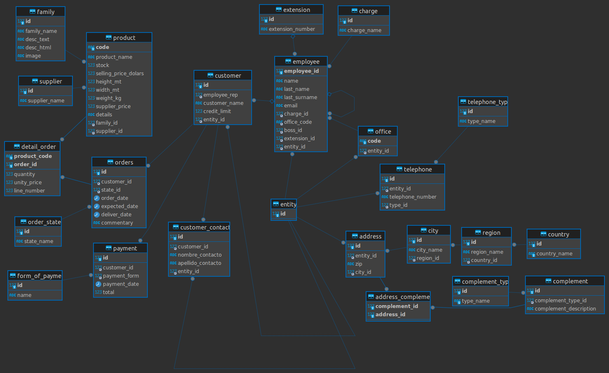

# Proyecto de bases de datos (#1)


## :white_flower: Base de datos de jardineria :white_flower:


### 👤Autoría

- **Nombre:** Sofia Marcela Medina Díaz.
- **Grupo:** J1


### 🗃️ Diagrama entidad - relación




### 🔧 Inserción de datos

- Para la insercion de los datos se utilizaron [procedimientos almacenados](procedimientos_de_insercion.sql) apoyados por [funciones](utileria:D/functions.sql).

- La llamada a los  respectivos procedimientos se encuentra en la carpeta de `insertions`


### 🔨 Creación de tablas

- El script de la creacion de la bases de datos se encuentra en [en un archivo por separado](creacionDB.sql).

### :eyes: Vistas

1. listado indicando todas las ciudades donde hay oficinas y el número de empleados que tiene.

   ```sql
   CREATE VIEW ciudades_empleado AS 
   SELECT ci.city_name AS nombre_ciudad, 
   COUNT(em.employee_id) AS n_empleados FROM office AS o
   INNER JOIN employee AS em ON em.office_code = o.code
   INNER JOIN entity AS e ON o.entity_id = e.id
   INNER JOIN address AS ad ON ad.entity_id = e.id
   INNER JOIN city AS ci ON ci.id = ad.city_id
   GROUP BY nombre_ciudad;
   
   SELECT nombre_ciudad,n_empleados FROM  ciudades_empleado;
   ```

   

2. la suma total de todos los pagos que se realizaron para cada uno de los años que aparecen en la tabla pagos.

   ```SQL
   CREATE OR REPLACE VIEW pagos_año AS 
   SELECT YEAR(payment_date) AS anio_pago, 
   SUM(pa.total) AS suma_pago FROM payment AS pa
   GROUP BY anio_pago;
   ```


3. Devuelve el nombre de los representantes de ventas y el número de clientes al que atiende cada uno.

   ```sql
   CREATE OR REPLACE VIEW empleado_clientes AS 
   SELECT COUNT(cu.id) AS numero_clientes,
   CONCAT_WS(' ', em.name, em.last_name)  AS nombre_representante
   FROM employee AS em
   INNER JOIN customer AS cu ON em.employee_id = cu.employee_rep
   GROUP BY nombre_representante;
   ```


4. número de clientes que tiene la empresa.

   ```sql
   CREATE OR REPLACE VIEW numero_clientes AS 
   SELECT COUNT(id) FROM customer;
   ```


5. Numero de pedidos que  hay en cada estado

   ```sql
   CREATE OR REPLACE VIEW pedidos_estado AS 
   SELECT COUNT(ord.id), os.state_name FROM orders AS ord
   INNER JOIN order_state AS os ON os.id = ord.state_id
   GROUP BY os.state_name;
   ```


6. istado de los productos que nunca han aparecido en un pedido.

   ```sql
   CREATE OR REPLACE VIEW productos_sin_pedidos AS 
   SELECT DISTINCT  p.product_name FROM product AS p
   LEFT JOIN detail_order AS od ON od.product_code = p.code
   WHERE od.product_code IS NULL;
   ```


7. listado que muestre solamente los empleados que no tienen un cliente asociado.

   ```sql
   CREATE OR REPLACE VIEW empleados_sin_cliente AS 
   SELECT  em.name, em.last_name  FROM employee AS em
   LEFT JOIN customer AS cu ON em.employee_id = cu.employee_rep
   WHERE cu.employee_rep IS NULL;
   ```


8.  listado que muestre solamente los clientes que no han realizado ningún pedido.

   ```sql
   CREATE OR REPLACE VIEW clientes_sin_pedido AS 
   SELECT cu.customer_name FROM customer AS cu
   LEFT JOIN orders AS o ON o.customer_id = cu.id
   WHERE o.customer_id IS NULL;
   ```


9. listado que muestre solamente los clientes que no han realizado ningún pago.

   ```sql
   CREATE OR REPLACE VIEW clientes_sin_pago AS 
   SELECT cu.customer_name FROM customer AS cu
   LEFT JOIN payment AS pa ON pa.customer_id = cu.id
   WHERE pa.customer_id IS NULL;
   ```


10. listado con el nombre de los empleados junto con el nombre de sus jefes.

    ```sql
    CREATE OR REPLACE VIEW empleados_jefes AS 
    SELECT CONCAT_WS(' ', e.name, e.last_name, e.last_surname) AS nombre_empleado,
    CONCAT_WS(' ', b.name, b.last_name, b.last_surname) AS nombre_jefe FROM employee AS e
    LEFT JOIN employee AS b ON e.boss_id = b.employee_id;
    ```

    

### :wrench: Procedimientos almacenados

1. crear una nueva gama de productos

   ```sql
   DELIMITER &&
   DROP PROCEDURE IF EXISTS create_family&&
   CREATE PROCEDURE  create_family(
       IN gama VARCHAR(25),
       IN descripcion TEXT,
       IN html TEXT,
       IN imagen VARCHAR(256)
   )
   BEGIN 
   	DECLARE family_search INT;
   	-- numero de nombres de familias coincidientes
   	SELECT COUNT(id) INTO family_search FROM family 
   	WHERE family_name LIKE gama;
   	
   	IF  family_search = 0 THEN
   		INSERT INTO family(family_name, desc_text, desc_html, image)
   		VALUES(gama, descripcion, html, imagen);
   	ELSE
   		SELECT 'Ya existe una familia con ese nombre' AS message;
   	END IF;
   END &&
   DELIMITER ;
   
   CALL create_family('Flores', 'Familia de plantas que producen flores vistosas y coloridas.', '<p>Las flores son la parte más llamativa de muchas plantas y juegan un papel crucial en la polinización.</p>', 'imagen_flores.jpg');
   
   ```


2. crear nuevo cargo para los empleados

   ```sql
   DELIMITER &&
   DROP PROCEDURE IF EXISTS create_charge&&
   CREATE PROCEDURE  create_charge(
       IN nombre VARCHAR(70)
   )
   BEGIN 
   	DECLARE charge_search INT;
   	
   	-- numero de nombres de cargos coincidientes
   	SELECT COUNT(id) INTO charge_search FROM charge 
   	WHERE charge_name LIKE nombre;
   	
   	IF  charge_search = 0 THEN
   		INSERT INTO charge(charge_name)
   		VALUES(nombre);
   	ELSE
   		SELECT 'Ya existe un cargo con ese nombre' AS message;
   	END IF;
   END &&
   DELIMITER ;
   
   CALL create_charge('Asesor comercial');
   ```


3. Eliminar un producto y sus rastros en las compras

   ```SQL
   DELIMITER %%
   DROP PROCEDURE IF EXISTS delete_product%%
   CREATE PROCEDURE delete_product(
   	IN codigo VARCHAR(15)
   )
   BEGIN
   	/* Eliminar de detalle de orden */
   	DELETE FROM detail_order WHERE product_code = codigo;
   	DELETE FROM product WHERE code = codigo;
   END %%
   DELIMITER ;
   
   CALL delete_product('11679');
   ```


4. Cambiar el nombre de un producto 

   ```SQL
   DELIMITER //
   DROP PROCEDURE IF EXISTS change_name_product //
   CREATE PROCEDURE change_name_product(
       IN product_code VARCHAR(15),
   	IN new_name VARCHAR(70)
   )
   BEGIN
   	DECLARE name_search INT;
   	
   	-- numero de nombres de productos coincidientes
   	SELECT COUNT(product_name) INTO name_search FROM product 
   	WHERE product_name LIKE new_name;
   	
   	IF  name_search = 0 THEN
   		UPDATE product SET product_name = new_name
   		WHERE code = product_code;
   	ELSE
   		SELECT 'Ya existe un producto con ese nombre' AS message;
   	END IF;
   END //
   DELIMITER ;
   
   CALL change_name_product('FR-2', 'semilla de aguacate');
   ```


5. Agregar nueva forma de pago

   ```sql
   DELIMITER &&
   DROP PROCEDURE IF EXISTS create_payment_form&&
   CREATE PROCEDURE  create_payment_form(
       IN nombre VARCHAR(20)
   )
   BEGIN 
   	DECLARE payment_search INT;
   	
   	-- numero de nombres  coincidientes
   	SELECT COUNT(name) INTO payment_search FROM form_of_payment 
   	WHERE name LIKE nombre;
   	
   	IF  payment_search = 0 THEN
   		INSERT INTO form_of_payment(name)
   		VALUES(nombre);
   	ELSE
   		SELECT 'Ya existe esa forma de pago' AS message;
   	END IF;
   END &&
   DELIMITER ;
   
   CALL create_payment_form('En linea');
   ```


6. Procedimiento para obtener el nombre y id del jefe a partir del id de cierto empleado.

   ```sql
   DELIMITER %%
   DROP PROCEDURE IF EXISTS search_boss%%
   CREATE PROCEDURE search_boss(
   IN id INT
   )
   BEGIN
       SELECT CONCAT_WS(' ', e.name, e.last_name, e.last_surname) AS nombre_empleado,
       CONCAT_WS(' ', b.name, b.last_name, b.last_surname) AS nombre_jefe, b.employee_id AS jefe_id 
       FROM employee AS e
       LEFT JOIN employee AS b ON e.boss_id = b.employee_id
       WHERE e.employee_id = id;
   END%%
   DELIMITER ;
   
   CALL search_boss(2);
   ```


7. Procedimiento para devolver el nombre del representante de cierto cliente a partir de su id

   ```SQL
   DELIMITER //
   DROP PROCEDURE IF EXISTS search_rep//
   CREATE PROCEDURE search_rep(IN id INT)
   BEGIN
   	SELECT CONCAT_WS(' ', e.name, e.last_name, e.last_surname) AS nombre_empleado,
   	cu.customer_name AS nombre_cliente FROM employee AS e
   	INNER JOIN customer AS cu ON cu.employee_rep = e.employee_id
   	WHERE cu.id = id;
   END //
   DELIMITER ;
   
   CALL search_rep(8);
   ```

   

### 🔍 Consultas


#### Consultas sobre una tabla

1. Devuelve un listado con el código de oficina y la ciudad donde hay oficinas.

   ```sql
   SELECT o.code, ci.city_name FROM office AS o 
   INNER JOIN entity AS e ON o.entity_id = e.id
   INNER JOIN address AS ad ON ad.entity_id = e.id
   INNER JOIN city AS ci ON ci.id = ad.city_id;
   
   /*
   +---------+----------------------+
   | code    | city_name            |
   +---------+----------------------+
   | BCN-ES  | Barcelona            |
   | BOS-USA | Boston               |
   | LON-UK  | Londres              |
   | MAD-ES  | Madrid               |
   | PAR-FR  | Paris                |
   | SFC-USA | San Francisco        |
   | SYD-AU  | Sydney               |
   | TAL-ES  | Talavera de la Reina |
   | TOK-JP  | Tokyo                |
   +---------+----------------------+
   */
   ```

   

2. Devuelve un listado con la ciudad y el teléfono de las oficinas de España.

   ```sql
   SELECT ci.city_name AS ciudad, te.telephone_number AS telefono FROM office AS o 
   INNER JOIN entity AS e ON o.entity_id = e.id
   INNER JOIN telephone AS te ON te.entity_id = e.id
   INNER JOIN address AS ad ON ad.entity_id = e.id
   INNER JOIN city AS ci ON ci.id = ad.city_id
   INNER JOIN region AS re ON ci.region_id = re.id
   INNER JOIN country AS co ON co.id = re.country_id
   WHERE co.country_name = 'Spain';
   
   /*
   +----------------------+----------------+
   | ciudad               | telefono       |
   +----------------------+----------------+
   | Barcelona            | +34 93 3561182 |
   | Madrid               | +34 91 7514487 |
   | Talavera de la Reina | +34 925 867231 |
   +----------------------+----------------+
   */
   ```

   

3. Devuelve un listado con el nombre, apellidos y email de los empleados cuyo jefe tiene un código de jefe igual a 7.

  ```sql
  SELECT name, last_name, last_surname, email FROM employee WHERE boss_id = 7;
  
  /*
  +---------+-----------+--------------+--------------------------+
  | name    | last_name | last_surname | email                    |
  +---------+-----------+--------------+--------------------------+
  | Mariano | López     | Murcia       | mlopez@jardineria.es     |
  | Lucio   | Campoamor | Martín       | lcampoamor@jardineria.es |
  | Hilario | Rodriguez | Huertas      | hrodriguez@jardineria.es |
  +---------+-----------+--------------+--------------------------+
  */
  ```

  

4. Devuelve el nombre del puesto, nombre, apellidos y email del jefe de la empresa.

  ```sql
  SELECT ch.charge_name, e.name, e.last_name, e.last_surname, e.email FROM employee AS e
  INNER JOIN charge AS ch ON ch.id = e.charge_id
  WHERE boss_id IS NULL;
  
  /*
  +------------------+--------+-----------+--------------+----------------------+
  | charge_name      | name   | last_name | last_surname | email                |
  +------------------+--------+-----------+--------------+----------------------+
  | Director General | Marcos | Magaña    | Perez        | marcos@jardineria.es |
  +------------------+--------+-----------+--------------+----------------------+
  */
  ```

  

5. Devuelve un listado con el nombre, apellidos y puesto de aquellos empleados que no sean representantes de ventas.

  ```sql
  SELECT ch.charge_name, e.name, e.last_name, e.last_surname FROM employee AS e
  INNER JOIN charge AS ch ON ch.id = e.charge_id
  WHERE ch.charge_name <> 'Representante ventas';
  
  /*
  +-----------------------+----------+------------+--------------+
  | charge_name           | name     | last_name  | last_surname |
  +-----------------------+----------+------------+--------------+
  | Director General      | Marcos   | Magaña     | Perez        |
  | Subdirector Marketing | Ruben    | López      | Martinez     |
  | Subdirector Ventas    | Alberto  | Soria      | Carrasco     |
  | Secretaria            | Maria    | Solís      | Jerez        |
  | Director Oficina      | Carlos   | Soria      | Jimenez      |
  | Director Oficina      | Emmanuel | Magaña     | Perez        |
  | Director Oficina      | Francois | Fignon     |              |
  | Director Oficina      | Michael  | Bolton     |              |
  | Director Oficina      | Hilary   | Washington |              |
  | Director Oficina      | Nei      | Nishikori  |              |
  | Director Oficina      | Amy      | Johnson    |              |
  | Director Oficina      | Kevin    | Fallmer    |              |
  +-----------------------+----------+------------+--------------+
  */
  ```

  

6. Devuelve un listado con el nombre de los todos los clientes españoles.

  ```sql
  SELECT cu.customer_name AS nombre_cliente FROM customer AS cu
  INNER JOIN entity AS e ON cu.entity_id = e.id
  INNER JOIN address AS ad ON ad.entity_id = e.id
  INNER JOIN city AS ci ON ci.id = ad.city_id
  INNER JOIN region AS re ON ci.region_id = re.id
  INNER JOIN country AS co ON co.id = re.country_id
  WHERE co.country_name = 'Spain' OR co.country_name = 'España';
  
  /*
  +--------------------------------+
  | nombre_cliente                 |
  +--------------------------------+
  | Americh Golf Management SL     |
  | El Prat                        |
  | Beragua                        |
  | Club Golf Puerta del hierro    |
  | Naturagua                      |
  | DaraDistribuciones             |
  | Madrileña de riegos            |
  | Dardena S.A.                   |
  | Jardin de Flores               |
  | Naturajardin                   |
  | Jardines y Mansiones Cactus SL |
  | Jardinerías Matías SL          |
  | Flores S.L.                    |
  | Lasas S.A.                     |
  | Lasas S.A.                     |
  | Flores Marivi                  |
  | Fuenla City                    |
  | Jardineria Sara                |
  | Campohermoso                   |
  | Camunas Jardines S.L.          |
  | Flowers, S.A                   |
  | Golf S.A.                      |
  | Aloha                          |
  | Sotogrande                     |
  | Vivero Humanes                 |
  | Top Campo                      |
  | Agrojardin                     |
  +--------------------------------+
  */
  ```

  

7. Devuelve un listado con los distintos estados por los que puede pasar un pedido.

  ```sql
  SELECT state_name FROM order_state;
  
  /*
  +------------+
  | state_name |
  +------------+
  | Entregado  |
  | Pendiente  |
  | Rechazado  |
  +------------+
  */
  ```

  

8. Devuelve un listado con el código de cliente de aquellos clientes que realizaron algún pago en 2008. Tenga en cuenta que deberá eliminar aquellos códigos de cliente que aparezcan repetidos. Resuelva la consulta:

  • Utilizando la función YEAR de MySQL.

  ```sql
  SELECT DISTINCT cu.id AS codigo_cliente FROM payment AS pa
  INNER JOIN customer AS cu ON cu.id = pa.customer_id 
  WHERE YEAR(payment_date) = 2008;
  
  /*
  +----------------+
  | codigo_cliente |
  +----------------+
  |              1 |
  |             13 |
  |             14 |
  |             26 |
  +----------------+
  */
  ```

  • Utilizando la función DATE_FORMAT de MySQL.

  ```sql
  SELECT DISTINCT cu.id AS codigo_cliente FROM payment AS pa
  INNER JOIN customer AS cu ON cu.id = pa.customer_id 
  WHERE DATE_FORMAT(payment_date, "%Y") = 2008;
  
  /*
  +----------------+
  | codigo_cliente |
  +----------------+
  |              1 |
  |             13 |
  |             14 |
  |             26 |
  +----------------+
  */
  ```

  • Sin utilizar ninguna de las funciones anteriores.

  ```sql
  SELECT DISTINCT cu.id AS codigo_cliente FROM payment AS pa
  INNER JOIN customer AS cu ON cu.id = pa.customer_id 
  WHERE payment_date LIKE  '2008%';
  
  /*
  +----------------+
  | codigo_cliente |
  +----------------+
  |              1 |
  |             13 |
  |             14 |
  |             26 |
  +----------------+
  */
  ```

  

9. Devuelve un listado con el código de pedido, código de cliente, fecha esperada y fecha de entrega de los pedidos que no han sido entregados a tiempo.

  ```sql
  SELECT o.id, cu.id, o.expected_date, o.deliver_date FROM orders AS o
  INNER JOIN customer AS cu ON cu.id = o.customer_id
  WHERE o.expected_date < o.deliver_date;
  /*
  +-----+----+---------------+--------------+
  | id  | id | expected_date | deliver_date |
  +-----+----+---------------+--------------+
  |   9 |  1 | 2008-12-27    | 2008-12-28   |
  |  60 |  1 | 2008-12-27    | 2008-12-28   |
  |  28 |  3 | 2009-02-17    | 2009-02-20   |
  |  68 |  3 | 2009-02-17    | 2009-02-20   |
  |  32 |  4 | 2007-01-19    | 2007-01-27   |
  |  13 |  7 | 2009-01-14    | 2009-01-15   |
  |  16 |  7 | 2009-01-07    | 2009-01-15   |
  |  17 |  7 | 2009-01-09    | 2009-01-11   |
  |  18 |  9 | 2009-01-06    | 2009-01-07   |
  |  22 |  9 | 2009-01-11    | 2009-01-13   |
  |  31 | 13 | 2008-09-30    | 2008-10-04   |
  |  55 | 14 | 2009-01-10    | 2009-01-11   |
  |  38 | 19 | 2009-03-06    | 2009-03-07   |
  |  39 | 19 | 2009-03-07    | 2009-03-09   |
  |  40 | 19 | 2009-03-10    | 2009-03-13   |
  |  42 | 19 | 2009-03-23    | 2009-03-27   |
  |  43 | 23 | 2009-03-26    | 2009-03-28   |
  |  44 | 23 | 2009-03-27    | 2009-03-30   |
  |  45 | 23 | 2009-03-04    | 2009-03-07   |
  |  46 | 23 | 2009-03-04    | 2009-03-05   |
  |  49 | 26 | 2008-07-22    | 2008-07-30   |
  |  92 | 27 | 2009-04-30    | 2009-05-03   |
  | 103 | 30 | 2009-01-20    | 2009-01-24   |
  | 106 | 30 | 2009-05-15    | 2009-05-20   |
  | 123 | 30 | 2009-01-20    | 2009-01-24   |
  | 126 | 30 | 2009-05-15    | 2009-05-20   |
  |  96 | 35 | 2008-04-12    | 2008-04-13   |
  | 112 | 36 | 2009-04-06    | 2009-05-07   |
  | 113 | 36 | 2008-11-09    | 2009-01-09   |
  | 114 | 36 | 2009-01-29    | 2009-01-31   |
  | 115 | 36 | 2009-01-26    | 2009-02-27   |
  | 128 | 38 | 2008-12-10    | 2008-12-29   |
  +-----+----+---------------+--------------+
  */
  ```

  

10. Devuelve un listado con el código de pedido, código de cliente, fecha esperada y fecha de entrega de los pedidos cuya fecha de entrega ha sido al menos dos días antes de la fecha esperada.

    • Utilizando la función ADDDATE de MySQL.

    ```sql
    SELECT id, customer_id, expected_date, deliver_date FROM orders
    WHERE ADDDATE(deliver_date, INTERVAL 2 DAY) <= expected_date;
    
    /*
    +----+-------------+---------------+--------------+
    | id | customer_id | expected_date | deliver_date |
    +----+-------------+---------------+--------------+
    |  2 |           5 | 2007-10-28    | 2007-10-26   |
    | 24 |          14 | 2008-07-31    | 2008-07-25   |
    | 30 |          13 | 2008-09-03    | 2008-08-31   |
    | 36 |          14 | 2008-12-15    | 2008-12-10   |
    | 53 |          13 | 2008-11-15    | 2008-11-09   |
    | 89 |          35 | 2007-12-13    | 2007-12-10   |
    | 91 |          27 | 2009-03-29    | 2009-03-27   |
    | 93 |          27 | 2009-05-30    | 2009-05-17   |
    +----+-------------+---------------+--------------+
    
    */
    ```

    • Utilizando la función DATEDIFF de MySQL.

    ```sql
    SELECT id, customer_id, expected_date, deliver_date FROM orders
    WHERE ADDDATE(deliver_date, INTERVAL 2 DAY) <= expected_date;
    
    /*
    +----+-------------+---------------+--------------+
    | id | customer_id | expected_date | deliver_date |
    +----+-------------+---------------+--------------+
    |  2 |           5 | 2007-10-28    | 2007-10-26   |
    | 24 |          14 | 2008-07-31    | 2008-07-25   |
    | 30 |          13 | 2008-09-03    | 2008-08-31   |
    | 36 |          14 | 2008-12-15    | 2008-12-10   |
    | 53 |          13 | 2008-11-15    | 2008-11-09   |
    | 89 |          35 | 2007-12-13    | 2007-12-10   |
    | 91 |          27 | 2009-03-29    | 2009-03-27   |
    | 93 |          27 | 2009-05-30    | 2009-05-17   |
    +----+-------------+---------------+--------------+
    */
    ```

    • ¿Sería posible resolver esta consulta utilizando el operador de suma + o resta -?

    ```sql
    SELECT id, customer_id, expected_date, deliver_date FROM orders
    WHERE deliver_date + 2 <= expected_date;	
    
    /*
    +----+-------------+---------------+--------------+
    | id | customer_id | expected_date | deliver_date |
    +----+-------------+---------------+--------------+
    |  2 |           5 | 2007-10-28    | 2007-10-26   |
    | 24 |          14 | 2008-07-31    | 2008-07-25   |
    | 30 |          13 | 2008-09-03    | 2008-08-31   |
    | 36 |          14 | 2008-12-15    | 2008-12-10   |
    | 53 |          13 | 2008-11-15    | 2008-11-09   |
    | 89 |          35 | 2007-12-13    | 2007-12-10   |
    | 91 |          27 | 2009-03-29    | 2009-03-27   |
    | 93 |          27 | 2009-05-30    | 2009-05-17   |
    +----+-------------+---------------+--------------+
    
    */
    ```

    

11. Devuelve un listado de todos los pedidos que fueron rechazados en 2009.

    ```sql
    SELECT id, customer_id, expected_date, deliver_date, commentary FROM orders
    WHERE state_id = 3 AND YEAR(deliver_date) = 2009;
    
    /*
    +-----+-------------+---------------+--------------+-----------------------------------------------------------+
    | id  | customer_id | expected_date | deliver_date | commentary                                                |
    +-----+-------------+---------------+--------------+-----------------------------------------------------------+
    |  21 |           9 | 2009-01-09    | 2009-01-09   | mal pago                                                  |
    |  40 |          19 | 2009-03-10    | 2009-03-13   | NULL                                                      |
    |  46 |          23 | 2009-03-04    | 2009-03-05   | NULL                                                      |
    | 113 |          36 | 2008-11-09    | 2009-01-09   | El producto ha sido rechazado por la tardanza de el envio |
    +-----+-------------+---------------+--------------+-----------------------------------------------------------+
    */
    ```

    

12. Devuelve un listado de todos los pedidos que han sido entregados en el mes de enero de cualquier año.

    ```sql
    SELECT  customer_id, expected_date, deliver_date FROM orders
    WHERE MONTH(deliver_date) = 1;
    
    /*
    +-------------+---------------+--------------+
    | customer_id | expected_date | deliver_date |
    +-------------+---------------+--------------+
    |           5 | 2006-01-19    | 2006-01-19   |
    |           7 | 2009-01-14    | 2009-01-15   |
    |           7 | 2009-01-12    | 2009-01-11   |
    |           7 | 2009-01-07    | 2009-01-15   |
    |           7 | 2009-01-09    | 2009-01-11   |
    |           9 | 2009-01-06    | 2009-01-07   |
    |           9 | 2009-01-09    | 2009-01-09   |
    |           9 | 2009-01-11    | 2009-01-13   |
    |           4 | 2007-01-19    | 2007-01-27   |
    |          14 | 2009-01-10    | 2009-01-11   |
    |           3 | 2009-01-31    | 2009-01-30   |
    |           1 | 2009-01-31    | 2009-01-30   |
    |          15 | 2009-01-13    | 2009-01-13   |
    |          28 | 2009-01-13    | 2009-01-13   |
    |          28 | 2009-01-29    | 2009-01-29   |
    |          35 | 2008-01-19    | 2008-01-19   |
    |          16 | 2009-01-15    | 2009-01-15   |
    |          16 | 2009-01-08    | 2009-01-08   |
    |          30 | 2009-01-20    | 2009-01-24   |
    |          36 | 2008-11-09    | 2009-01-09   |
    |          36 | 2009-01-29    | 2009-01-31   |
    |          16 | 2009-01-15    | 2009-01-15   |
    |          16 | 2009-01-08    | 2009-01-08   |
    |          30 | 2009-01-20    | 2009-01-24   |
    +-------------+---------------+--------------+
    */
    ```

    

13. Devuelve un listado con todos los pagos que se realizaron en el año 2008 mediante Paypal. Ordene el resultado de mayor a menor.

    ```sql
    SELECT pa.customer_id , pa.payment_date FROM payment AS pa
    INNER JOIN form_of_payment AS fp ON fp.id = pa.payment_form
    WHERE fp.name = 'Paypal' AND YEAR(payment_date) = 2008
    ORDER BY payment_date DESC;
    
    /*
    +-------------+--------------+
    | customer_id | payment_date |
    +-------------+--------------+
    |           1 | 2008-12-10   |
    |           1 | 2008-11-10   |
    |          13 | 2008-08-04   |
    |          14 | 2008-07-15   |
    |          26 | 2008-03-18   |
    +-------------+--------------+
    */
    ```

    

14. Devuelve un listado con todas las formas de pago que aparecen en la tabla pago. Tenga en cuenta que no deben aparecer formas de pago repetidas.

    ```sql
    SELECT DISTINCT fp.name FROM payment AS pa
    INNER JOIN form_of_payment AS fp ON fp.id = pa.payment_form;
    
    /*
    +---------------+
    | name          |
    +---------------+
    | PayPal        |
    | Transferencia |
    | Cheque        |
    +---------------+
    
    */
    ```

    

15. Devuelve un listado con todos los productos que pertenecen a la gama Ornamentales y que tienen más de 100 unidades en stock. El listado deberá estar ordenado por su precio de venta, mostrando en primer lugar los de mayor precio.

    ```sql
    SELECT p.product_name, p.stock FROM product AS p
    INNER JOIN family AS f ON p.family_id = f.id
    WHERE f.family_name = 'Ornamentales' AND p.stock > 100
    ORDER BY p.stock DESC;
    
    /*
    +--------------------------------------------+-------+
    | product_name                               | stock |
    +--------------------------------------------+-------+
    | Escallonia (Mix)                           |   120 |
    | Evonimus Emerald Gayeti                    |   120 |
    | Evonimus Pulchellus                        |   120 |
    | Forsytia Intermedia "Lynwood"              |   120 |
    | Hibiscus Syriacus  "Diana" -Blanco Puro    |   120 |
    | Hibiscus Syriacus  "Helene" -Blanco-C.rojo |   120 |
    | Hibiscus Syriacus "Pink Giant" Rosa        |   120 |
    | Laurus Nobilis Arbusto - Ramificado Bajo   |   120 |
    | Lonicera Nitida                            |   120 |
    | Lonicera Nitida "Maigrum"                  |   120 |
    | Lonicera Pileata                           |   120 |
    | Philadelphus "Virginal"                    |   120 |
    | Prunus pisardii                            |   120 |
    | Viburnum Tinus "Eve Price"                 |   120 |
    | Weigelia "Bristol Ruby"                    |   120 |
    +--------------------------------------------+-------+
    */
    ```

    

16. Devuelve un listado con todos los clientes que sean de la ciudad de Madrid y cuyo representante de ventas tenga el código de empleado 11 o 30.

    ```sql
    SELECT cu.customer_name, cu.employee_rep  FROM customer AS cu
    INNER JOIN entity AS e ON e.id = cu.entity_id
    INNER JOIN address AS a ON a.entity_id = cu.entity_id
    INNER JOIN city AS ci ON ci.id = a.city_id
    WHERE ci.city_name = 'Madrid' AND cu.employee_rep IN (11,30);
    
    /*
    +-----------------------------+--------------+
    | customer_name               | employee_rep |
    +-----------------------------+--------------+
    | Beragua                     |           11 |
    | Club Golf Puerta del hierro |           11 |
    | Naturagua                   |           11 |
    | DaraDistribuciones          |           11 |
    | Madrileña de riegos         |           11 |
    | Jardin de Flores            |           30 |
    | Naturajardin                |           30 |
    +-----------------------------+--------------+
    */
     
    ```
    
    

#### Consultas multitabla (Composición interna)

1. Obtén un listado con el nombre de cada cliente y el nombre y apellido de su representante de ventas.

  ```SQL
  SELECT cu.customer_name, e.name, e.last_name FROM customer AS cu
  INNER JOIN employee AS e ON e.employee_id = cu.employee_rep;
  
  /*
  +--------------------------------+-----------------+------------+
  | customer_name                  | name            | last_name  |
  +--------------------------------+-----------------+------------+
  | Flores Marivi                  | Felipe          | Rosas      |
  | Flowers, S.A                   | Felipe          | Rosas      |
  | Fuenla City                    | Felipe          | Rosas      |
  | Top Campo                      | Felipe          | Rosas      |
  | Jardineria Sara                | Felipe          | Rosas      |
  | Lasas S.A.                     | Mariano         | López      |
  | Lasas S.A.                     | Mariano         | López      |
  | Camunas Jardines S.L.          | Mariano         | López      |
  | Dardena S.A.                   | Mariano         | López      |
  | Jardines y Mansiones Cactus SL | Lucio           | Campoamor  |
  | Jardinerías Matías SL          | Lucio           | Campoamor  |
  | Beragua                        | Emmanuel        | Magaña     |
  | Club Golf Puerta del hierro    | Emmanuel        | Magaña     |
  | Naturagua                      | Emmanuel        | Magaña     |
  | DaraDistribuciones             | Emmanuel        | Magaña     |
  | Madrileña de riegos            | Emmanuel        | Magaña     |
  | Golf S.A.                      | José Manuel     | Martinez   |
  | Americh Golf Management SL     | José Manuel     | Martinez   |
  | Aloha                          | José Manuel     | Martinez   |
  | El Prat                        | José Manuel     | Martinez   |
  | Sotogrande                     | José Manuel     | Martinez   |
  | france telecom                 | Lionel          | Narvaez    |
  | Musée du Louvre                | Lionel          | Narvaez    |
  | Flores S.L.                    | Michael         | Bolton     |
  | The Magic Garden               | Michael         | Bolton     |
  | GoldFish Garden                | Walter Santiago | Sanchez    |
  | Gardening Associates           | Walter Santiago | Sanchez    |
  | Gerudo Valley                  | Lorena          | Paxton     |
  | Tendo Garden                   | Lorena          | Paxton     |
  | Jardin de Flores               | Julian          | Bellinelli |
  | Naturajardin                   | Julian          | Bellinelli |
  | Vivero Humanes                 | Julian          | Bellinelli |
  | Agrojardin                     | Julian          | Bellinelli |
  | Campohermoso                   | Julian          | Bellinelli |
  | Tutifruti S.A                  | Mariko          | Kishi      |
  | El Jardin Viviente S.L         | Mariko          | Kishi      |
  +--------------------------------+-----------------+------------+
  
  */
  ```

  

2. Muestra el nombre de los clientes que hayan realizado pagos junto con el nombre de sus representantes de ventas.

  ```SQL
  SELECT cu.customer_name, e.name, e.last_name FROM customer AS cu
  INNER JOIN payment AS pa ON pa.customer_id = cu.id
  INNER JOIN employee AS e ON e.employee_id = cu.employee_rep;
  
  /*
  +--------------------------------+-----------------+------------+
  | customer_name                  | name            | last_name  |
  +--------------------------------+-----------------+------------+
  | GoldFish Garden                | Walter Santiago | Sanchez    |
  | GoldFish Garden                | Walter Santiago | Sanchez    |
  | Gardening Associates           | Walter Santiago | Sanchez    |
  | Gardening Associates           | Walter Santiago | Sanchez    |
  | Gardening Associates           | Walter Santiago | Sanchez    |
  | Gerudo Valley                  | Lorena          | Paxton     |
  | Gerudo Valley                  | Lorena          | Paxton     |
  | Gerudo Valley                  | Lorena          | Paxton     |
  | Gerudo Valley                  | Lorena          | Paxton     |
  | Gerudo Valley                  | Lorena          | Paxton     |
  | Tendo Garden                   | Lorena          | Paxton     |
  | Beragua                        | Emmanuel        | Magaña     |
  | Naturagua                      | Emmanuel        | Magaña     |
  | Camunas Jardines S.L.          | Mariano         | López      |
  | Dardena S.A.                   | Mariano         | López      |
  | Jardin de Flores               | Julian          | Bellinelli |
  | Jardin de Flores               | Julian          | Bellinelli |
  | Flores Marivi                  | Felipe          | Rosas      |
  | Golf S.A.                      | José Manuel     | Martinez   |
  | Sotogrande                     | José Manuel     | Martinez   |
  | Jardines y Mansiones Cactus SL | Lucio           | Campoamor  |
  | Jardinerías Matías SL          | Lucio           | Campoamor  |
  | Agrojardin                     | Julian          | Bellinelli |
  | Jardineria Sara                | Felipe          | Rosas      |
  | Tutifruti S.A                  | Mariko          | Kishi      |
  | El Jardin Viviente S.L         | Mariko          | Kishi      |
  +--------------------------------+-----------------+------------+
  */
  ```

  

3. Muestra el nombre de los clientes que no hayan realizado pagos junto con el nombre de sus representantes de ventas.

  ```SQL
  SELECT cu.customer_name, e.name, e.last_name FROM customer AS cu
  INNER JOIN employee AS e ON e.employee_id = cu.employee_rep
  LEFT JOIN payment AS pa ON pa.customer_id = cu.id
  WHERE pa.customer_id IS NULL;
  
  /*
  +-----------------------------+--------------+------------+
  | customer_name               | name         | last_name  |
  +-----------------------------+--------------+------------+
  | Flowers, S.A                | Felipe       | Rosas      |
  | Fuenla City                 | Felipe       | Rosas      |
  | Top Campo                   | Felipe       | Rosas      |
  | Lasas S.A.                  | Mariano      | López      |
  | Lasas S.A.                  | Mariano      | López      |
  | Club Golf Puerta del hierro | Emmanuel     | Magaña     |
  | DaraDistribuciones          | Emmanuel     | Magaña     |
  | Madrileña de riegos         | Emmanuel     | Magaña     |
  | Americh Golf Management SL  | José Manuel  | Martinez   |
  | Aloha                       | José Manuel  | Martinez   |
  | El Prat                     | José Manuel  | Martinez   |
  | france telecom              | Lionel       | Narvaez    |
  | Musée du Louvre             | Lionel       | Narvaez    |
  | Flores S.L.                 | Michael      | Bolton     |
  | The Magic Garden            | Michael      | Bolton     |
  | Naturajardin                | Julian       | Bellinelli |
  | Vivero Humanes              | Julian       | Bellinelli |
  | Campohermoso                | Julian       | Bellinelli |
  +-----------------------------+--------------+------------+
  
  */
  ```

  

4. Devuelve el nombre de los clientes que han hecho pagos y el nombre de sus representantes junto con la ciudad de la oficina a la que pertenece el representante.

  ```SQL
  SELECT cu.customer_name, em.name, em.last_name, ci.city_name  FROM employee AS em
  INNER JOIN customer AS cu ON em.employee_id = cu.employee_rep
  INNER JOIN office AS o ON em.office_code = o.code
  INNER JOIN entity AS e ON o.entity_id = e.id
  INNER JOIN address AS ad ON ad.entity_id = e.id
  INNER JOIN city AS ci ON ci.id = ad.city_id
  INNER JOIN payment AS pa ON pa.customer_id = cu.id;
  
  /*
  +--------------------------------+-----------------+------------+----------------------+
  | customer_name                  | name            | last_name  | city_name            |
  +--------------------------------+-----------------+------------+----------------------+
  | Beragua                        | Emmanuel        | Magaña     | Barcelona            |
  | Naturagua                      | Emmanuel        | Magaña     | Barcelona            |
  | Golf S.A.                      | José Manuel     | Martinez   | Barcelona            |
  | Sotogrande                     | José Manuel     | Martinez   | Barcelona            |
  | Gerudo Valley                  | Lorena          | Paxton     | Boston               |
  | Gerudo Valley                  | Lorena          | Paxton     | Boston               |
  | Gerudo Valley                  | Lorena          | Paxton     | Boston               |
  | Gerudo Valley                  | Lorena          | Paxton     | Boston               |
  | Gerudo Valley                  | Lorena          | Paxton     | Boston               |
  | Tendo Garden                   | Lorena          | Paxton     | Boston               |
  | Camunas Jardines S.L.          | Mariano         | López      | Madrid               |
  | Dardena S.A.                   | Mariano         | López      | Madrid               |
  | Jardines y Mansiones Cactus SL | Lucio           | Campoamor  | Madrid               |
  | Jardinerías Matías SL          | Lucio           | Campoamor  | Madrid               |
  | GoldFish Garden                | Walter Santiago | Sanchez    | San Francisco        |
  | GoldFish Garden                | Walter Santiago | Sanchez    | San Francisco        |
  | Gardening Associates           | Walter Santiago | Sanchez    | San Francisco        |
  | Gardening Associates           | Walter Santiago | Sanchez    | San Francisco        |
  | Gardening Associates           | Walter Santiago | Sanchez    | San Francisco        |
  | Jardin de Flores               | Julian          | Bellinelli | Sydney               |
  | Jardin de Flores               | Julian          | Bellinelli | Sydney               |
  | Agrojardin                     | Julian          | Bellinelli | Sydney               |
  | Tutifruti S.A                  | Mariko          | Kishi      | Sydney               |
  | El Jardin Viviente S.L         | Mariko          | Kishi      | Sydney               |
  | Flores Marivi                  | Felipe          | Rosas      | Talavera de la Reina |
  | Jardineria Sara                | Felipe          | Rosas      | Talavera de la Reina |
  +--------------------------------+-----------------+------------+----------------------+
  */
  
  ```

  

5. Devuelve el nombre de los clientes que no hayan hecho pagos y el nombre de sus representantes junto con la ciudad de la oficina a la que pertenece el representante.

  ```SQL
  SELECT cu.customer_name, em.name, em.last_name, ci.city_name  FROM employee AS em
  INNER JOIN customer AS cu ON em.employee_id = cu.employee_rep
  INNER JOIN office AS o ON em.office_code = o.code
  INNER JOIN entity AS e ON o.entity_id = e.id
  INNER JOIN address AS ad ON ad.entity_id = e.id
  INNER JOIN city AS ci ON ci.id = ad.city_id
  LEFT JOIN payment AS pa ON pa.customer_id = cu.id
  WHERE pa.customer_id IS NULL;
  
  /*
  +-----------------------------+--------------+------------+----------------------+
  | customer_name               | name         | last_name  | city_name            |
  +-----------------------------+--------------+------------+----------------------+
  | Club Golf Puerta del hierro | Emmanuel     | Magaña     | Barcelona            |
  | DaraDistribuciones          | Emmanuel     | Magaña     | Barcelona            |
  | Madrileña de riegos         | Emmanuel     | Magaña     | Barcelona            |
  | Americh Golf Management SL  | José Manuel  | Martinez   | Barcelona            |
  | Aloha                       | José Manuel  | Martinez   | Barcelona            |
  | El Prat                     | José Manuel  | Martinez   | Barcelona            |
  | Lasas S.A.                  | Mariano      | López      | Madrid               |
  | Lasas S.A.                  | Mariano      | López      | Madrid               |
  | france telecom              | Lionel       | Narvaez    | Paris                |
  | Musée du Louvre             | Lionel       | Narvaez    | Paris                |
  | Flores S.L.                 | Michael      | Bolton     | San Francisco        |
  | The Magic Garden            | Michael      | Bolton     | San Francisco        |
  | Naturajardin                | Julian       | Bellinelli | Sydney               |
  | Vivero Humanes              | Julian       | Bellinelli | Sydney               |
  | Campohermoso                | Julian       | Bellinelli | Sydney               |
  | Flowers, S.A                | Felipe       | Rosas      | Talavera de la Reina |
  | Fuenla City                 | Felipe       | Rosas      | Talavera de la Reina |
  | Top Campo                   | Felipe       | Rosas      | Talavera de la Reina |
  +-----------------------------+--------------+------------+----------------------+
  */
  ```

  

6. Lista la dirección de las oficinas que tengan clientes en Fuenlabrada.

   ```SQL
   SELECT o.code, CONCAT_WS( ' ',ct.type_name, co.complement_description) AS direccion
   , ci.city_name  FROM employee AS em
   INNER JOIN customer AS cu ON em.employee_id = cu.employee_rep
   INNER JOIN office AS o ON em.office_code = o.code
   INNER JOIN entity AS e ON cu.entity_id = e.id
   INNER JOIN address AS ad ON ad.entity_id = e.id
   INNER JOIN address_complement AS ac ON ad.id = ac.address_id 
   INNER JOIN complement AS co ON co.id = ac.complement_id
   INNER JOIN complement_type AS ct ON ct.id = co.complement_type_id
   INNER JOIN city AS ci ON ci.id = ad.city_id
   WHERE ci.city_name = 'Fuenlabrada';
   
   /*
   +--------+-----------+-------------+
   | code   | direccion | city_name   |
   +--------+-----------+-------------+
   | MAD-ES | Calle 25  | Fuenlabrada |
   | MAD-ES | Calle 25  | Fuenlabrada |
   | TAL-ES | Calle 25  | Fuenlabrada |
   | TAL-ES | Calle 25  | Fuenlabrada |
   | TAL-ES | Calle 25  | Fuenlabrada |
   | SYD-AU | Calle 25  | Fuenlabrada |
   +--------+-----------+-------------+
   */
   ```

   

7. Devuelve el nombre de los clientes y el nombre de sus representantes junto con la ciudad de la oficina a la que pertenece el representante.

  ```SQL
  SELECT cu.customer_name, em.name, em.last_name, ci.city_name  FROM employee AS em
  INNER JOIN customer AS cu ON em.employee_id = cu.employee_rep
  INNER JOIN office AS o ON em.office_code = o.code
  INNER JOIN entity AS e ON cu.entity_id = e.id
  INNER JOIN address AS ad ON ad.entity_id = e.id
  INNER JOIN city AS ci ON ci.id = ad.city_id;
  
  /*
  +--------------------------------+-----------------+------------+--------------------------+
  | customer_name                  | name            | last_name  | city_name                |
  +--------------------------------+-----------------+------------+--------------------------+
  | Beragua                        | Emmanuel        | Magaña     | Madrid                   |
  | Club Golf Puerta del hierro    | Emmanuel        | Magaña     | Madrid                   |
  | Naturagua                      | Emmanuel        | Magaña     | Madrid                   |
  | DaraDistribuciones             | Emmanuel        | Magaña     | Madrid                   |
  | Madrileña de riegos            | Emmanuel        | Magaña     | Madrid                   |
  | Golf S.A.                      | José Manuel     | Martinez   | Santa cruz de Tenerife   |
  | Americh Golf Management SL     | José Manuel     | Martinez   | Barcelona                |
  | Aloha                          | José Manuel     | Martinez   | Canarias                 |
  | El Prat                        | José Manuel     | Martinez   | Barcelona                |
  | Sotogrande                     | José Manuel     | Martinez   | Sotogrande               |
  | Gerudo Valley                  | Lorena          | Paxton     | New York                 |
  | Tendo Garden                   | Lorena          | Paxton     | Miami                    |
  | Lasas S.A.                     | Mariano         | López      | Fuenlabrada              |
  | Lasas S.A.                     | Mariano         | López      | Fuenlabrada              |
  | Camunas Jardines S.L.          | Mariano         | López      | San Lorenzo del Escorial |
  | Dardena S.A.                   | Mariano         | López      | Madrid                   |
  | Jardines y Mansiones Cactus SL | Lucio           | Campoamor  | Madrid                   |
  | Jardinerías Matías SL          | Lucio           | Campoamor  | Madrid                   |
  | france telecom                 | Lionel          | Narvaez    | Paris                    |
  | Musée du Louvre                | Lionel          | Narvaez    | Paris                    |
  | Flores S.L.                    | Michael         | Bolton     | Madrid                   |
  | The Magic Garden               | Michael         | Bolton     | London                   |
  | GoldFish Garden                | Walter Santiago | Sanchez    | San Francisco            |
  | Gardening Associates           | Walter Santiago | Sanchez    | Miami                    |
  | Jardin de Flores               | Julian          | Bellinelli | Madrid                   |
  | Naturajardin                   | Julian          | Bellinelli | Madrid                   |
  | Vivero Humanes                 | Julian          | Bellinelli | Humanes                  |
  | Agrojardin                     | Julian          | Bellinelli | Getafe                   |
  | Campohermoso                   | Julian          | Bellinelli | Fuenlabrada              |
  | Tutifruti S.A                  | Mariko          | Kishi      | Sydney                   |
  | El Jardin Viviente S.L         | Mariko          | Kishi      | Sydney                   |
  | Flores Marivi                  | Felipe          | Rosas      | Fuenlabrada              |
  | Flowers, S.A                   | Felipe          | Rosas      | Montornes del valles     |
  | Fuenla City                    | Felipe          | Rosas      | Fuenlabrada              |
  | Top Campo                      | Felipe          | Rosas      | Humanes                  |
  | Jardineria Sara                | Felipe          | Rosas      | Fuenlabrada              |
  +--------------------------------+-----------------+------------+--------------------------+
  */
  
  ```

  

8. Devuelve un listado con el nombre de los empleados junto con el nombre de sus jefes.

  ```SQL
  SELECT CONCAT_WS(' ', e.name, e.last_name, e.last_surname) AS nombre_empleado,
  CONCAT_WS(' ', b.name, b.last_name, b.last_surname) AS nombre_jefe FROM employee AS e
  LEFT JOIN employee AS b ON e.boss_id = b.employee_id;
  
  /*
  +---------------------------------+------------------------+
  | nombre_empleado                 | nombre_jefe            |
  +---------------------------------+------------------------+
  | Marcos Magaña Perez             |                        |
  | Ruben López Martinez            | Marcos Magaña Perez    |
  | Alberto Soria Carrasco          | Ruben López Martinez   |
  | Maria Solís Jerez               | Ruben López Martinez   |
  | Felipe Rosas Marquez            | Alberto Soria Carrasco |
  | Juan Carlos Ortiz Serrano       | Alberto Soria Carrasco |
  | Carlos Soria Jimenez            | Alberto Soria Carrasco |
  | Mariano López Murcia            | Carlos Soria Jimenez   |
  | Lucio Campoamor Martín          | Carlos Soria Jimenez   |
  | Hilario Rodriguez Huertas       | Carlos Soria Jimenez   |
  | Emmanuel Magaña Perez           | Alberto Soria Carrasco |
  | José Manuel Martinez De la Osa  | Emmanuel Magaña Perez  |
  | David Palma Aceituno            | Emmanuel Magaña Perez  |
  | Oscar Palma Aceituno            | Emmanuel Magaña Perez  |
  | Francois Fignon                 | Alberto Soria Carrasco |
  | Lionel Narvaez                  | Francois Fignon        |
  | Laurent Serra                   | Francois Fignon        |
  | Michael Bolton                  | Alberto Soria Carrasco |
  | Walter Santiago Sanchez Lopez   | Michael Bolton         |
  | Hilary Washington               | Alberto Soria Carrasco |
  | Marcus Paxton                   | Hilary Washington      |
  | Lorena Paxton                   | Hilary Washington      |
  | Nei Nishikori                   | Alberto Soria Carrasco |
  | Narumi Riko                     | Nei Nishikori          |
  | Takuma Nomura                   | Nei Nishikori          |
  | Amy Johnson                     | Alberto Soria Carrasco |
  | Larry Westfalls                 | Amy Johnson            |
  | John Walton                     | Amy Johnson            |
  | Kevin Fallmer                   | Alberto Soria Carrasco |
  | Julian Bellinelli               | Kevin Fallmer          |
  | Mariko Kishi                    | Kevin Fallmer          |
  +---------------------------------+------------------------+
  
  */
  ```

  

9. Devuelve un listado que muestre el nombre de cada empleados, el nombre de su jefe y el nombre del jefe de sus jefe.

  ```SQL
  SELECT CONCAT_WS(' ', e.name, e.last_name, e.last_surname) AS nombre_empleado,
  CONCAT_WS(' ', b.name, b.last_name, b.last_surname) AS nombre_jefe,
  CONCAT_WS(' ', d.name, d.last_name, d.last_surname) AS jefe_de_jefes  FROM employee AS e
  LEFT  JOIN employee AS b ON e.boss_id = b.employee_id
  LEFT JOIN employee AS d ON b.boss_id = d.employee_id;
  
  /*
  +---------------------------------+------------------------+------------------------+
  | nombre_empleado                 | nombre_jefe            | jefe_de_jefes          |
  +---------------------------------+------------------------+------------------------+
  | Marcos Magaña Perez             |                        |                        |
  | Ruben López Martinez            | Marcos Magaña Perez    |                        |
  | Alberto Soria Carrasco          | Ruben López Martinez   | Marcos Magaña Perez    |
  | Maria Solís Jerez               | Ruben López Martinez   | Marcos Magaña Perez    |
  | Felipe Rosas Marquez            | Alberto Soria Carrasco | Ruben López Martinez   |
  | Juan Carlos Ortiz Serrano       | Alberto Soria Carrasco | Ruben López Martinez   |
  | Carlos Soria Jimenez            | Alberto Soria Carrasco | Ruben López Martinez   |
  | Mariano López Murcia            | Carlos Soria Jimenez   | Alberto Soria Carrasco |
  | Lucio Campoamor Martín          | Carlos Soria Jimenez   | Alberto Soria Carrasco |
  | Hilario Rodriguez Huertas       | Carlos Soria Jimenez   | Alberto Soria Carrasco |
  | Emmanuel Magaña Perez           | Alberto Soria Carrasco | Ruben López Martinez   |
  | José Manuel Martinez De la Osa  | Emmanuel Magaña Perez  | Alberto Soria Carrasco |
  | David Palma Aceituno            | Emmanuel Magaña Perez  | Alberto Soria Carrasco |
  | Oscar Palma Aceituno            | Emmanuel Magaña Perez  | Alberto Soria Carrasco |
  | Francois Fignon                 | Alberto Soria Carrasco | Ruben López Martinez   |
  | Lionel Narvaez                  | Francois Fignon        | Alberto Soria Carrasco |
  | Laurent Serra                   | Francois Fignon        | Alberto Soria Carrasco |
  | Michael Bolton                  | Alberto Soria Carrasco | Ruben López Martinez   |
  | Walter Santiago Sanchez Lopez   | Michael Bolton         | Alberto Soria Carrasco |
  | Hilary Washington               | Alberto Soria Carrasco | Ruben López Martinez   |
  | Marcus Paxton                   | Hilary Washington      | Alberto Soria Carrasco |
  | Lorena Paxton                   | Hilary Washington      | Alberto Soria Carrasco |
  | Nei Nishikori                   | Alberto Soria Carrasco | Ruben López Martinez   |
  | Narumi Riko                     | Nei Nishikori          | Alberto Soria Carrasco |
  | Takuma Nomura                   | Nei Nishikori          | Alberto Soria Carrasco |
  | Amy Johnson                     | Alberto Soria Carrasco | Ruben López Martinez   |
  | Larry Westfalls                 | Amy Johnson            | Alberto Soria Carrasco |
  | John Walton                     | Amy Johnson            | Alberto Soria Carrasco |
  | Kevin Fallmer                   | Alberto Soria Carrasco | Ruben López Martinez   |
  | Julian Bellinelli               | Kevin Fallmer          | Alberto Soria Carrasco |
  | Mariko Kishi                    | Kevin Fallmer          | Alberto Soria Carrasco |
  +---------------------------------+------------------------+------------------------+
  */
  
  ```

  

10. Devuelve el nombre de los clientes a los que no se les ha entregado a tiempo un pedido.

    ```SQL
    SELECT DISTINCT c.customer_name FROM customer AS c
    INNER JOIN orders AS o ON o.customer_id = c.id
    WHERE (o.deliver_date > o.expected_date);
    
    /*
    +--------------------------------+
    | customer_name                  |
    +--------------------------------+
    | GoldFish Garden                |
    | Beragua                        |
    | Naturagua                      |
    | Gardening Associates           |
    | Gerudo Valley                  |
    | Golf S.A.                      |
    | Sotogrande                     |
    | Jardines y Mansiones Cactus SL |
    | Dardena S.A.                   |
    | Jardinerías Matías SL          |
    | Tutifruti S.A                  |
    | Flores S.L.                    |
    | Jardineria Sara                |
    | Camunas Jardines S.L.          |
    | El Jardin Viviente S.L         |
    +--------------------------------+
    
    */
    ```
    
    
    
11. Devuelve un listado de las diferentes gamas de producto que ha comprado cada cliente. 

    ```SQL
    SELECT DISTINCT f.family_name, cu.customer_name FROM customer AS cu
    INNER JOIN orders AS o ON o.customer_id = cu.id
    INNER JOIN detail_order AS det ON o.id = det.order_id
    INNER JOIN product AS p ON p.code = det.product_code
    INNER JOIN family AS f ON f.id = p.family_id;
    
    /*
    +--------------+--------------------------------+
    | family_name  | customer_name                  |
    +--------------+--------------------------------+
    | Herramientas | Beragua                        |
    | Herramientas | Naturagua                      |
    | Herramientas | Gerudo Valley                  |
    | Herramientas | Golf S.A.                      |
    | Herramientas | Dardena S.A.                   |
    | Herramientas | Jardinerías Matías SL          |
    | Herramientas | El Jardin Viviente S.L         |
    | Herramientas | Jardin de Flores               |
    | Herramientas | Flores Marivi                  |
    | Herramientas | Jardineria Sara                |
    | Aromáticas   | GoldFish Garden                |
    | Aromáticas   | Golf S.A.                      |
    | Aromáticas   | Jardinerías Matías SL          |
    | Aromáticas   | El Jardin Viviente S.L         |
    | Aromáticas   | Tendo Garden                   |
    | Aromáticas   | Camunas Jardines S.L.          |
    | Aromáticas   | Jardin de Flores               |
    | Aromáticas   | Flores Marivi                  |
    | Aromáticas   | Sotogrande                     |
    | Aromáticas   | Jardineria Sara                |
    | Frutales     | Dardena S.A.                   |
    | Frutales     | Sotogrande                     |
    | Frutales     | El Jardin Viviente S.L         |
    | Frutales     | Tutifruti S.A                  |
    | Frutales     | Beragua                        |
    | Frutales     | Jardinerías Matías SL          |
    | Frutales     | Camunas Jardines S.L.          |
    | Frutales     | Jardines y Mansiones Cactus SL |
    | Frutales     | Gerudo Valley                  |
    | Frutales     | GoldFish Garden                |
    | Frutales     | Tendo Garden                   |
    | Frutales     | Gardening Associates           |
    | Frutales     | Agrojardin                     |
    | Frutales     | Jardineria Sara                |
    | Frutales     | Naturagua                      |
    | Frutales     | Jardin de Flores               |
    | Frutales     | Flores Marivi                  |
    | Frutales     | Flores S.L.                    |
    | Ornamentales | Beragua                        |
    | Ornamentales | Gardening Associates           |
    | Ornamentales | El Jardin Viviente S.L         |
    | Ornamentales | Dardena S.A.                   |
    | Ornamentales | Camunas Jardines S.L.          |
    | Ornamentales | Tendo Garden                   |
    | Ornamentales | Gerudo Valley                  |
    | Ornamentales | Agrojardin                     |
    | Ornamentales | Jardineria Sara                |
    | Ornamentales | Tutifruti S.A                  |
    | Ornamentales | Jardin de Flores               |
    | Ornamentales | Flores Marivi                  |
    | Ornamentales | Naturagua                      |
    | Ornamentales | Jardines y Mansiones Cactus SL |
    | Ornamentales | GoldFish Garden                |
    +--------------+--------------------------------+
    */
    ```
    
    

#### Consultas multitabla (Composición externa)


1. Devuelve un listado que muestre solamente los clientes que no han realizado ningún pago.

  ```SQL
  SELECT cu.customer_name FROM customer AS cu
  LEFT JOIN payment AS pa ON pa.customer_id = cu.id
  WHERE pa.customer_id IS NULL;
  
  /*
  +-----------------------------+
  | customer_name               |
  +-----------------------------+
  | Lasas S.A.                  |
  | Club Golf Puerta del hierro |
  | DaraDistribuciones          |
  | Madrileña de riegos         |
  | Lasas S.A.                  |
  | Flowers, S.A                |
  | Naturajardin                |
  | Americh Golf Management SL  |
  | Aloha                       |
  | El Prat                     |
  | Vivero Humanes              |
  | Fuenla City                 |
  | Top Campo                   |
  | Campohermoso                |
  | france telecom              |
  | Musée du Louvre             |
  | Flores S.L.                 |
  | The Magic Garden            |
  +-----------------------------+
  */
  ```

  

2. Devuelve un listado que muestre solamente los clientes que no han realizado ningún pedido.

  ```SQL
  SELECT cu.customer_name FROM customer AS cu
  LEFT JOIN orders AS o ON o.customer_id = cu.id
  WHERE o.customer_id IS NULL;
  
  /*
  +-----------------------------+
  | customer_name               |
  +-----------------------------+
  | Lasas S.A.                  |
  | Club Golf Puerta del hierro |
  | DaraDistribuciones          |
  | Madrileña de riegos         |
  | Lasas S.A.                  |
  | Flowers, S.A                |
  | Naturajardin                |
  | Americh Golf Management SL  |
  | Aloha                       |
  | El Prat                     |
  | Vivero Humanes              |
  | Fuenla City                 |
  | Top Campo                   |
  | Campohermoso                |
  | france telecom              |
  | Musée du Louvre             |
  | The Magic Garden            |
  +-----------------------------+
  */
  ```

  

3. Devuelve un listado que muestre los clientes que no han realizado ningún pago y los que no han realizado ningún pedido.

  ```SQL
  SELECT cu.customer_name FROM customer AS cu
  LEFT JOIN orders AS o ON o.customer_id = cu.id
  LEFT JOIN payment AS pa ON pa.customer_id = cu.id
  WHERE pa.customer_id IS NULL AND o.customer_id IS NULL;
  
  /*
  +-----------------------------+
  | customer_name               |
  +-----------------------------+
  | Lasas S.A.                  |
  | Club Golf Puerta del hierro |
  | DaraDistribuciones          |
  | Madrileña de riegos         |
  | Lasas S.A.                  |
  | Flowers, S.A                |
  | Naturajardin                |
  | Americh Golf Management SL  |
  | Aloha                       |
  | El Prat                     |
  | Vivero Humanes              |
  | Fuenla City                 |
  | Top Campo                   |
  | Campohermoso                |
  | france telecom              |
  | Musée du Louvre             |
  | The Magic Garden            |
  +-----------------------------+
  */
  ```

  

4. Devuelve un listado que muestre solamente los empleados que no tienen una oficina asociada.

  ```SQL
  SELECT  em.name, em.last_name FROM employee AS em
  LEFT JOIN office AS o ON em.office_code = o.code
  WHERE em.office_code IS NULL;
  
  /*
  Empty set (0,01 sec)
  */
  ```

  

5. Devuelve un listado que muestre solamente los empleados que no tienen un cliente asociado.

  ```SQL
  SELECT  em.name, em.last_name  FROM employee AS em
  LEFT JOIN customer AS cu ON em.employee_id = cu.employee_rep
  WHERE cu.employee_rep IS NULL;
  
  /*
  +-------------+------------+
  | name        | last_name  |
  +-------------+------------+
  | Marcos      | Magaña     |
  | Ruben       | López      |
  | Alberto     | Soria      |
  | Maria       | Solís      |
  | Juan Carlos | Ortiz      |
  | Carlos      | Soria      |
  | Hilario     | Rodriguez  |
  | David       | Palma      |
  | Oscar       | Palma      |
  | Francois    | Fignon     |
  | Laurent     | Serra      |
  | Hilary      | Washington |
  | Marcus      | Paxton     |
  | Nei         | Nishikori  |
  | Narumi      | Riko       |
  | Takuma      | Nomura     |
  | Amy         | Johnson    |
  | Larry       | Westfalls  |
  | John        | Walton     |
  | Kevin       | Fallmer    |
  +-------------+------------+
  */
  ```

  

6. Devuelve un listado que muestre solamente los empleados que no tienen un cliente asociado junto con los datos de la oficina donde trabajan.

  ```SQL
  SELECT  em.name, em.last_name, o.code  FROM employee AS em
  LEFT JOIN customer AS cu ON em.employee_id = cu.employee_rep
  INNER JOIN office AS o ON o.code = em.office_code
  WHERE cu.employee_rep IS NULL;
  
  /*
  +-------------+------------+---------+
  | name        | last_name  | code    |
  +-------------+------------+---------+
  | David       | Palma      | BCN-ES  |
  | Oscar       | Palma      | BCN-ES  |
  | Hilary      | Washington | BOS-USA |
  | Marcus      | Paxton     | BOS-USA |
  | Amy         | Johnson    | LON-UK  |
  | Larry       | Westfalls  | LON-UK  |
  | John        | Walton     | LON-UK  |
  | Carlos      | Soria      | MAD-ES  |
  | Hilario     | Rodriguez  | MAD-ES  |
  | Francois    | Fignon     | PAR-FR  |
  | Laurent     | Serra      | PAR-FR  |
  | Kevin       | Fallmer    | SYD-AU  |
  | Marcos      | Magaña     | TAL-ES  |
  | Ruben       | López      | TAL-ES  |
  | Alberto     | Soria      | TAL-ES  |
  | Maria       | Solís      | TAL-ES  |
  | Juan Carlos | Ortiz      | TAL-ES  |
  | Nei         | Nishikori  | TOK-JP  |
  | Narumi      | Riko       | TOK-JP  |
  | Takuma      | Nomura     | TOK-JP  |
  +-------------+------------+---------+
  */
  ```

  

7. Devuelve un listado que muestre los empleados que no tienen una oficina asociada y los que no tienen un cliente asociado.

  ```SQL
  SELECT  em.name, em.last_name  FROM employee AS em
  LEFT JOIN office AS o ON em.office_code = o.code
  LEFT JOIN customer AS cu ON em.employee_id = cu.employee_rep
  WHERE em.office_code IS NULL AND cu.employee_rep IS NULL;
  
  /* Empty set (0,00 sec) */
  ```

  

8. Devuelve un listado de los productos que nunca han aparecido en un pedido.

  ```SQL
  SELECT DISTINCT  p.product_name FROM product AS p
  LEFT JOIN detail_order AS od ON od.product_code = p.code
  WHERE od.product_code IS NULL;
  
  /*
  +-------------------------------------------------------------+
  | product_name                                                |
  +-------------------------------------------------------------+
  | Olea-Olivos                                                 |
  | Calamondin Mini                                             |
  | Camelia Blanco, Chrysler Rojo, Soraya Naranja,              |
  | Landora Amarillo, Rose Gaujard bicolor blanco-rojo          |
  | Kordes Perfect bicolor rojo-amarillo, Roundelay rojo fuerte |
  | Albaricoquero Corbato                                       |
  | Albaricoquero Moniqui                                       |
  | Albaricoquero Kurrot                                        |
  | Cerezo Burlat                                               |
  | Cerezo Picota                                               |
  | Ciruelo R. Claudia Verde                                    |
  | Ciruelo Golden Japan                                        |
  | Ciruelo Claudia Negra                                       |
  | Higuera Verdal                                              |
  | Higuera Breva                                               |
  | Melocotonero Spring Crest                                   |
  | Melocotonero Federica                                       |
  | Parra Uva de Mesa                                           |
  | Mandarino -Plantón joven                                    |
  | Peral Castell                                               |
  | Peral Williams                                              |
  | Peral Conference                                            |
  | Olivo Cipresino                                             |
  | Albaricoquero                                               |
  | Cerezo                                                      |
  | Ciruelo                                                     |
  | Granado                                                     |
  | Higuera                                                     |
  | Manzano                                                     |
  | Melocotonero                                                |
  | Membrillero                                                 |
  | Arbustos Mix Maceta                                         |
  | Mimosa Injerto CLASICA Dealbata                             |
  | Mimosa Semilla Bayleyana                                    |
  | Mimosa Semilla Espectabilis                                 |
  | Mimosa Semilla Longifolia                                   |
  | Mimosa Semilla Floribunda 4 estaciones                      |
  | Abelia Floribunda                                           |
  | Callistemom (Mix)                                           |
  | Corylus Avellana "Contorta"                                 |
  | Escallonia (Mix)                                            |
  | Evonimus Emerald Gayeti                                     |
  | Evonimus Pulchellus                                         |
  | Hibiscus Syriacus  "Helene" -Blanco-C.rojo                  |
  | Hibiscus Syriacus "Pink Giant" Rosa                         |
  | Lonicera Nitida "Maigrum"                                   |
  | Prunus pisardii                                             |
  | Weigelia "Bristol Ruby"                                     |
  | Leptospermum formado PIRAMIDE                               |
  | Leptospermum COPA                                           |
  | Nerium oleander-CALIDAD "GARDEN"                            |
  | Nerium Oleander Arbusto GRANDE                              |
  | Nerium oleander COPA  Calibre 6/8                           |
  | ROSAL TREPADOR                                              |
  | Solanum Jazminoide                                          |
  | Wisteria Sinensis  azul, rosa, blanca                       |
  | Wisteria Sinensis INJERTADAS DECÓ                          |
  | Bougamvillea Sanderiana Tutor                               |
  | Bougamvillea Sanderiana Espaldera                           |
  | Bougamvillea Sanderiana, 3 tut. piramide                    |
  | Expositor Árboles clima mediterráneo                        |
  | Expositor Árboles borde del mar                             |
  | Brachychiton Acerifolius                                    |
  | Cassia Corimbosa                                            |
  | Cassia Corimbosa                                            |
  | Chitalpa Summer Bells                                       |
  | Erytrina Kafra                                              |
  | Eucalyptus Citriodora                                       |
  | Eucalyptus Ficifolia                                        |
  | Hibiscus Syriacus  Var. Injertadas 1 Tallo                  |
  | Lagunaria Patersonii                                        |
  | Lagunaria Patersonii                                        |
  | Morus Alba                                                  |
  | Platanus Acerifolia                                         |
  | Salix Babylonica  Pendula                                   |
  | Tamarix  Ramosissima Pink Cascade                           |
  | Tecoma Stands                                               |
  | Tecoma Stands                                               |
  | Tipuana Tipu                                                |
  | Pleioblastus distichus-Bambú enano                          |
  | Sasa palmata                                                |
  | Phylostachys aurea                                          |
  | Phylostachys Bambusa Spectabilis                            |
  | Phylostachys biseti                                         |
  | Pseudosasa japonica (Metake)                                |
  | Pseudosasa japonica (Metake)                                |
  | Cedrus Deodara "Feeling Blue" Novedad                       |
  | Juniperus chinensis "Blue Alps"                             |
  | Juniperus Chinensis Stricta                                 |
  | Juniperus squamata "Blue Star"                              |
  | Juniperus x media Phitzeriana verde                         |
  | Bismarckia Nobilis                                          |
  | Brahea Armata                                               |
  | Brahea Edulis                                               |
  | Butia Capitata                                              |
  | Chamaerops Humilis                                          |
  | Chamaerops Humilis "Cerifera"                               |
  | Chrysalidocarpus Lutescens -ARECA                           |
  | Cordyline Australis -DRACAENA                               |
  | Cycas Revoluta                                              |
  | Dracaena Drago                                              |
  | Livistonia Decipiens                                        |
  | Rhaphis Excelsa                                             |
  | Sabal Minor                                                 |
  | Trachycarpus Fortunei                                       |
  | Washingtonia Robusta                                        |
  | Zamia Furfuracaea                                           |
  +-------------------------------------------------------------+
  */
  ```

  

9. Devuelve un listado de los productos que nunca han aparecido en un pedido. El resultado debe mostrar el nombre, la descripción y la imagen del producto.

  ```SQL
  SELECT DISTINCT  p.product_name, p.details, f.image FROM product AS p
  INNER JOIN family AS f ON f.id = p.family_id
  LEFT JOIN detail_order AS od ON od.product_code = p.code
  WHERE od.product_code IS NULL;
  
                                                                                             /*                                                                                           +-------------------------------------------------------------+----------------------------------------------------------------------------------------------------------------------------------------------------------------------------------------------------------------------------------------------------------------------------------------------------------------------------------------------------------------------------------------------------------------------------------------------------------------------------------------------------------------------------------------------------------------------------------------------------------------------------------------------------------------------------------------------------------------------------------------------------+-------+
  | product_name                                                | details                                                                                                                                                                                                                                                                                                                                                                                                                                                                                                                                                                                                                                                                                                                                            | image |
  +-------------------------------------------------------------+----------------------------------------------------------------------------------------------------------------------------------------------------------------------------------------------------------------------------------------------------------------------------------------------------------------------------------------------------------------------------------------------------------------------------------------------------------------------------------------------------------------------------------------------------------------------------------------------------------------------------------------------------------------------------------------------------------------------------------------------------+-------+
  | Olea-Olivos                                                 | Existen dos hipótesis sobre el origen del olivo, una que postula que proviene de las costas de Siria, Líbano e Israel y otra que considera que lo considera originario de Asia menor. La llegada a Europa probablemente tuvo lugar de mano de los Fenicios, en transito por Chipre, Creta, e Islas del Mar Egeo, pasando a Grecia y más tarde a Italia. Los primeros indicios de la presencia del olivo en las costas mediterráneas españolas coinciden con el dominio romano, aunque fueron posteriormente los árabes los que impulsaron su cultivo en Andalucía, convirtiendo a España en el primer país productor de aceite de oliva a nivel mundial.                                                                                           | NULL  |
  | Calamondin Mini                                             | Se trata de un pequeño arbolito de copa densa, con tendencia a la verticalidad, inerme o con cortas espinas. Sus hojas son pequeñas, elípticas de 5-10 cm de longitud, con los pecíolos estrechamente alados.Posee 1 o 2 flores en situación axilar, al final de las ramillas.Sus frutos son muy pequeños (3-3,5 cm de diámetro), con pocas semillas, esféricos u ovales, con la zona apical aplanada; corteza de color naranja-rojizo, muy fina y fácilmente separable de la pulpa, que es dulce, ácida y comestible..                                                                                                                                                                                                                            | NULL  |
  | Camelia Blanco, Chrysler Rojo, Soraya Naranja,              |                                                                                                                                                                                                                                                                                                                                                                                                                                                                                                                                                                                                                                                                                                                                                    | NULL  |
  | Landora Amarillo, Rose Gaujard bicolor blanco-rojo          |                                                                                                                                                                                                                                                                                                                                                                                                                                                                                                                                                                                                                                                                                                                                                    | NULL  |
  | Kordes Perfect bicolor rojo-amarillo, Roundelay rojo fuerte |                                                                                                                                                                                                                                                                                                                                                                                                                                                                                                                                                                                                                                                                                                                                                    | NULL  |
  | Albaricoquero Corbato                                       | árbol que puede pasar de los 6 m de altura, en la región mediterránea con ramas formando una copa redondeada. La corteza del tronco es pardo-violácea, agrietada; las ramas son rojizas y extendidas cuando jóvenes y las ramas secundarias son cortas, divergentes y escasas. Las yemas latentes son frecuentes especialmente sobre las ramas viejas.                                                                                                                                                                                                                                                                                                                                                                                             | NULL  |
  | Albaricoquero Moniqui                                       | árbol que puede pasar de los 6 m de altura, en la región mediterránea con ramas formando una copa redondeada. La corteza del tronco es pardo-violácea, agrietada; las ramas son rojizas y extendidas cuando jóvenes y las ramas secundarias son cortas, divergentes y escasas. Las yemas latentes son frecuentes especialmente sobre las ramas viejas.                                                                                                                                                                                                                                                                                                                                                                                             | NULL  |
  | Albaricoquero Kurrot                                        | árbol que puede pasar de los 6 m de altura, en la región mediterránea con ramas formando una copa redondeada. La corteza del tronco es pardo-violácea, agrietada; las ramas son rojizas y extendidas cuando jóvenes y las ramas secundarias son cortas, divergentes y escasas. Las yemas latentes son frecuentes especialmente sobre las ramas viejas.                                                                                                                                                                                                                                                                                                                                                                                             | NULL  |
  | Cerezo Burlat                                               | Las principales especies de cerezo cultivadas en el mundo son el cerezo dulce (Prunus avium), el guindo (P. cerasus) y el cerezo "Duke", híbrido de los anteriores. Ambas especies son naturales del sureste de Europa y oeste de Asia. El cerezo dulce tuvo su origen probablemente en el mar Negro y en el mar Caspio, difundiéndose después hacia Europa y Asia, llevado por los pájaros y las migraciones humanas. Fue uno de los frutales más apreciados por los griegos y con el Imperio Romano se extendió a regiones muy diversas. En la actualidad, el cerezo se encuentra difundido por numerosas regiones y países del mundo con clima templado                                                                                         | NULL  |
  | Cerezo Picota                                               | Las principales especies de cerezo cultivadas en el mundo son el cerezo dulce (Prunus avium), el guindo (P. cerasus) y el cerezo "Duke", híbrido de los anteriores. Ambas especies son naturales del sureste de Europa y oeste de Asia. El cerezo dulce tuvo su origen probablemente en el mar Negro y en el mar Caspio, difundiéndose después hacia Europa y Asia, llevado por los pájaros y las migraciones humanas. Fue uno de los frutales más apreciados por los griegos y con el Imperio Romano se extendió a regiones muy diversas. En la actualidad, el cerezo se encuentra difundido por numerosas regiones y países del mundo con clima templado                                                                                         | NULL  |
  | Ciruelo R. Claudia Verde                                    | árbol de tamaño mediano que alcanza una altura máxima de 5-6 m. Tronco de corteza pardo-azulada, brillante, lisa o agrietada longitudinalmente. Produce ramas alternas, pequeñas, delgadas, unas veces lisas, glabras y otras pubescentes y vellosas                                                                                                                                                                                                                                                                                                                                                                                                                                                                                               | NULL  |
  | Ciruelo Golden Japan                                        | árbol de tamaño mediano que alcanza una altura máxima de 5-6 m. Tronco de corteza pardo-azulada, brillante, lisa o agrietada longitudinalmente. Produce ramas alternas, pequeñas, delgadas, unas veces lisas, glabras y otras pubescentes y vellosas                                                                                                                                                                                                                                                                                                                                                                                                                                                                                               | NULL  |
  | Ciruelo Claudia Negra                                       | árbol de tamaño mediano que alcanza una altura máxima de 5-6 m. Tronco de corteza pardo-azulada, brillante, lisa o agrietada longitudinalmente. Produce ramas alternas, pequeñas, delgadas, unas veces lisas, glabras y otras pubescentes y vellosas                                                                                                                                                                                                                                                                                                                                                                                                                                                                                               | NULL  |
  | Higuera Verdal                                              | La higuera (Ficus carica L.) es un árbol típico de secano en los países mediterráneos. Su rusticidad y su fácil multiplicación hacen de la higuera un frutal muy apropiado para el cultivo extensivo.. Siempre ha sido considerado como árbol que no requiere cuidado alguno una vez plantado y arraigado, limitándose el hombre a recoger de él los frutos cuando maduran, unos para consumo en fresco y otros para conserva. Las únicas higueras con cuidados culturales esmerados, en muchas comarcas, son las brevales, por el interés económico de su primera cosecha, la de brevas.                                                                                                                                                          | NULL  |
  | Higuera Breva                                               | La higuera (Ficus carica L.) es un árbol típico de secano en los países mediterráneos. Su rusticidad y su fácil multiplicación hacen de la higuera un frutal muy apropiado para el cultivo extensivo.. Siempre ha sido considerado como árbol que no requiere cuidado alguno una vez plantado y arraigado, limitándose el hombre a recoger de él los frutos cuando maduran, unos para consumo en fresco y otros para conserva. Las únicas higueras con cuidados culturales esmerados, en muchas comarcas, son las brevales, por el interés económico de su primera cosecha, la de brevas.                                                                                                                                                          | NULL  |
  | Melocotonero Spring Crest                                   | Árbol caducifolio de porte bajo con corteza lisa, de color ceniciento. Sus hojas son alargadas con el margen ligeramente aserrado, de color verde brillante, algo más claras por el envés. El melocotonero está muy arraigado en la cultura asiática.
  En Japón, el noble heroe Momotaro, una especie de Cid japonés, nació del interior de un enorme melocotón que flotaba río abajo.
  En China se piensa que comer melocotón confiere longevidad al ser humano, ya que formaba parte de la dieta de sus dioses inmortales.                                                                                                                                                                                                                       | NULL  |
  | Melocotonero Federica                                       | Árbol caducifolio de porte bajo con corteza lisa, de color ceniciento. Sus hojas son alargadas con el margen ligeramente aserrado, de color verde brillante, algo más claras por el envés. El melocotonero está muy arraigado en la cultura asiática.
  En Japón, el noble heroe Momotaro, una especie de Cid japonés, nació del interior de un enorme melocotón que flotaba río abajo.
  En China se piensa que comer melocotón confiere longevidad al ser humano, ya que formaba parte de la dieta de sus dioses inmortales.                                                                                                                                                                                                                       | NULL  |
  | Parra Uva de Mesa                                           |                                                                                                                                                                                                                                                                                                                                                                                                                                                                                                                                                                                                                                                                                                                                                    | NULL  |
  | Mandarino -Plantón joven                                    |                                                                                                                                                                                                                                                                                                                                                                                                                                                                                                                                                                                                                                                                                                                                                    | NULL  |
  | Peral Castell                                               | Árbol piramidal, redondeado en su juventud, luego oval, que llega hasta 20 metros de altura y por término medio vive 65 años.Tronco alto, grueso, de corteza agrietada, gris, de la cual se destacan con frecuencia placas lenticulares.Las ramas se insertan formando ángulo agudo con el tronco (45º), de corteza lisa, primero verde y luego gris-violácea, con numerosas lenticelas.                                                                                                                                                                                                                                                                                                                                                           | NULL  |
  | Peral Williams                                              | Árbol piramidal, redondeado en su juventud, luego oval, que llega hasta 20 metros de altura y por término medio vive 65 años.Tronco alto, grueso, de corteza agrietada, gris, de la cual se destacan con frecuencia placas lenticulares.Las ramas se insertan formando ángulo agudo con el tronco (45º), de corteza lisa, primero verde y luego gris-violácea, con numerosas lenticelas.                                                                                                                                                                                                                                                                                                                                                           | NULL  |
  | Peral Conference                                            | Árbol piramidal, redondeado en su juventud, luego oval, que llega hasta 20 metros de altura y por término medio vive 65 años.Tronco alto, grueso, de corteza agrietada, gris, de la cual se destacan con frecuencia placas lenticulares.Las ramas se insertan formando ángulo agudo con el tronco (45º), de corteza lisa, primero verde y luego gris-violácea, con numerosas lenticelas.                                                                                                                                                                                                                                                                                                                                                           | NULL  |
  | Olivo Cipresino                                             | Existen dos hipótesis sobre el origen del olivo, una que postula que proviene de las costas de Siria, Líbano e Israel y otra que considera que lo considera originario de Asia menor. La llegada a Europa probablemente tuvo lugar de mano de los Fenicios, en transito por Chipre, Creta, e Islas del Mar Egeo, pasando a Grecia y más tarde a Italia. Los primeros indicios de la presencia del olivo en las costas mediterráneas españolas coinciden con el dominio romano, aunque fueron posteriormente los árabes los que impulsaron su cultivo en Andalucía, convirtiendo a España en el primer país productor de aceite de oliva a nivel mundial.                                                                                           | NULL  |
  | Albaricoquero                                               | árbol que puede pasar de los 6 m de altura, en la región mediterránea con ramas formando una copa redondeada. La corteza del tronco es pardo-violácea, agrietada; las ramas son rojizas y extendidas cuando jóvenes y las ramas secundarias son cortas, divergentes y escasas. Las yemas latentes son frecuentes especialmente sobre las ramas viejas.                                                                                                                                                                                                                                                                                                                                                                                             | NULL  |
  | Cerezo                                                      | Las principales especies de cerezo cultivadas en el mundo son el cerezo dulce (Prunus avium), el guindo (P. cerasus) y el cerezo "Duke", híbrido de los anteriores. Ambas especies son naturales del sureste de Europa y oeste de Asia. El cerezo dulce tuvo su origen probablemente en el mar Negro y en el mar Caspio, difundiéndose después hacia Europa y Asia, llevado por los pájaros y las migraciones humanas. Fue uno de los frutales más apreciados por los griegos y con el Imperio Romano se extendió a regiones muy diversas. En la actualidad, el cerezo se encuentra difundido por numerosas regiones y países del mundo con clima templado                                                                                         | NULL  |
  | Ciruelo                                                     | árbol de tamaño mediano que alcanza una altura máxima de 5-6 m. Tronco de corteza pardo-azulada, brillante, lisa o agrietada longitudinalmente. Produce ramas alternas, pequeñas, delgadas, unas veces lisas, glabras y otras pubescentes y vellosas                                                                                                                                                                                                                                                                                                                                                                                                                                                                                               | NULL  |
  | Granado                                                     | pequeño árbol caducifolio, a veces con porte arbustivo, de 3 a 6 m de altura, con el tronco retorcido. Madera dura y corteza escamosa de color grisáceo. Las ramitas jóvenes son más o menos cuadrangulares o angostas y de cuatro alas, posteriormente se vuelven redondas con corteza de color café grisáceo, la mayoría de las ramas, pero especialmente las pequeñas ramitas axilares, son en forma de espina o terminan en una espina aguda; la copa es extendida.                                                                                                                                                                                                                                                                            | NULL  |
  | Higuera                                                     | La higuera (Ficus carica L.) es un árbol típico de secano en los países mediterráneos. Su rusticidad y su fácil multiplicación hacen de la higuera un frutal muy apropiado para el cultivo extensivo.. Siempre ha sido considerado como árbol que no requiere cuidado alguno una vez plantado y arraigado, limitándose el hombre a recoger de él los frutos cuando maduran, unos para consumo en fresco y otros para conserva. Las únicas higueras con cuidados culturales esmerados, en muchas comarcas, son las brevales, por el interés económico de su primera cosecha, la de brevas.                                                                                                                                                          | NULL  |
  | Manzano                                                     | alcanza como máximo 10 m. de altura y tiene una copa globosa. Tronco derecho que normalmente alcanza de 2 a 2,5 m. de altura, con corteza cubierta de lenticelas, lisa, adherida, de color ceniciento verdoso sobre los ramos y escamosa y gris parda sobre las partes viejas del árbol. Tiene una vida de unos 60-80 años. Las ramas se insertan en ángulo abierto sobre el tallo, de color verde oscuro, a veces tendiendo a negruzco o violáceo. Los brotes jóvenes terminan con frecuencia en una espina                                                                                                                                                                                                                                       | NULL  |
  | Melocotonero                                                | Árbol caducifolio de porte bajo con corteza lisa, de color ceniciento. Sus hojas son alargadas con el margen ligeramente aserrado, de color verde brillante, algo más claras por el envés. El melocotonero está muy arraigado en la cultura asiática.
  En Japón, el noble heroe Momotaro, una especie de Cid japonés, nació del interior de un enorme melocotón que flotaba río abajo.
  En China se piensa que comer melocotón confiere longevidad al ser humano, ya que formaba parte de la dieta de sus dioses inmortales.                                                                                                                                                                                                                       | NULL  |
  | Membrillero                                                 | arbolito caducifolio de 4-6 m de altura con el tronco tortuoso y la corteza lisa, grisácea, que se desprende en escamas con la edad. Copa irregular, con ramas inermes, flexuosas, parduzcas, punteadas. Ramillas jóvenes tomentosas                                                                                                                                                                                                                                                                                                                                                                                                                                                                                                               | NULL  |
  | Arbustos Mix Maceta                                         |                                                                                                                                                                                                                                                                                                                                                                                                                                                                                                                                                                                                                                                                                                                                                    | NULL  |
  | Mimosa Injerto CLASICA Dealbata                             | Acacia dealbata. Nombre común o vulgar: Mimosa fina, Mimosa, Mimosa común, Mimosa plateada, Aromo francés. Familia: Mimosaceae. Origen: Australia, Sureste, (N. G. del Sur y Victoria). Arbol de follaje persistente muy usado en parques por su atractiva floración amarilla hacia fines del invierno. Altura: de 3 a 10 metros generalmente. Crecimiento rápido. Follaje perenne de tonos plateados, muy ornamental. Sus hojas son de textura fina, de color verde y sus flores amarillas que aparecen en racimos grandes. Florece de Enero a Marzo (Hemisferio Norte). Legumbre de 5-9 cm de longitud, recta o ligeramente curvada, con los bordes algo constreñidos entre las semillas, que se disponen en el fruto longitudinalmente...       | NULL  |
  | Mimosa Semilla Bayleyana                                    | Acacia dealbata. Nombre común o vulgar: Mimosa fina, Mimosa, Mimosa común, Mimosa plateada, Aromo francés. Familia: Mimosaceae. Origen: Australia, Sureste, (N. G. del Sur y Victoria). Arbol de follaje persistente muy usado en parques por su atractiva floración amarilla hacia fines del invierno. Altura: de 3 a 10 metros generalmente. Crecimiento rápido. Follaje perenne de tonos plateados, muy ornamental. Sus hojas son de textura fina, de color verde y sus flores amarillas que aparecen en racimos grandes. Florece de Enero a Marzo (Hemisferio Norte). Legumbre de 5-9 cm de longitud, recta o ligeramente curvada, con los bordes algo constreñidos entre las semillas, que se disponen en el fruto longitudinalmente...       | NULL  |
  | Mimosa Semilla Espectabilis                                 | Acacia dealbata. Nombre común o vulgar: Mimosa fina, Mimosa, Mimosa común, Mimosa plateada, Aromo francés. Familia: Mimosaceae. Origen: Australia, Sureste, (N. G. del Sur y Victoria). Arbol de follaje persistente muy usado en parques por su atractiva floración amarilla hacia fines del invierno. Altura: de 3 a 10 metros generalmente. Crecimiento rápido. Follaje perenne de tonos plateados, muy ornamental. Sus hojas son de textura fina, de color verde y sus flores amarillas que aparecen en racimos grandes. Florece de Enero a Marzo (Hemisferio Norte). Legumbre de 5-9 cm de longitud, recta o ligeramente curvada, con los bordes algo constreñidos entre las semillas, que se disponen en el fruto longitudinalmente...       | NULL  |
  | Mimosa Semilla Longifolia                                   | Acacia dealbata. Nombre común o vulgar: Mimosa fina, Mimosa, Mimosa común, Mimosa plateada, Aromo francés. Familia: Mimosaceae. Origen: Australia, Sureste, (N. G. del Sur y Victoria). Arbol de follaje persistente muy usado en parques por su atractiva floración amarilla hacia fines del invierno. Altura: de 3 a 10 metros generalmente. Crecimiento rápido. Follaje perenne de tonos plateados, muy ornamental. Sus hojas son de textura fina, de color verde y sus flores amarillas que aparecen en racimos grandes. Florece de Enero a Marzo (Hemisferio Norte). Legumbre de 5-9 cm de longitud, recta o ligeramente curvada, con los bordes algo constreñidos entre las semillas, que se disponen en el fruto longitudinalmente...       | NULL  |
  | Mimosa Semilla Floribunda 4 estaciones                      | Acacia dealbata. Nombre común o vulgar: Mimosa fina, Mimosa, Mimosa común, Mimosa plateada, Aromo francés. Familia: Mimosaceae. Origen: Australia, Sureste, (N. G. del Sur y Victoria). Arbol de follaje persistente muy usado en parques por su atractiva floración amarilla hacia fines del invierno. Altura: de 3 a 10 metros generalmente. Crecimiento rápido. Follaje perenne de tonos plateados, muy ornamental. Sus hojas son de textura fina, de color verde y sus flores amarillas que aparecen en racimos grandes. Florece de Enero a Marzo (Hemisferio Norte). Legumbre de 5-9 cm de longitud, recta o ligeramente curvada, con los bordes algo constreñidos entre las semillas, que se disponen en el fruto longitudinalmente...       | NULL  |
  | Abelia Floribunda                                           |                                                                                                                                                                                                                                                                                                                                                                                                                                                                                                                                                                                                                                                                                                                                                    | NULL  |
  | Callistemom (Mix)                                           | Limpitatubos. arbolito de 6-7 m de altura. Ramas flexibles y colgantes (de ahí lo de "llorón")..                                                                                                                                                                                                                                                                                                                                                                                                                                                                                                                                                                                                                                                   | NULL  |
  | Corylus Avellana "Contorta"                                 |                                                                                                                                                                                                                                                                                                                                                                                                                                                                                                                                                                                                                                                                                                                                                    | NULL  |
  | Escallonia (Mix)                                            |                                                                                                                                                                                                                                                                                                                                                                                                                                                                                                                                                                                                                                                                                                                                                    | NULL  |
  | Evonimus Emerald Gayeti                                     |                                                                                                                                                                                                                                                                                                                                                                                                                                                                                                                                                                                                                                                                                                                                                    | NULL  |
  | Evonimus Pulchellus                                         |                                                                                                                                                                                                                                                                                                                                                                                                                                                                                                                                                                                                                                                                                                                                                    | NULL  |
  | Hibiscus Syriacus  "Helene" -Blanco-C.rojo                  | Por su capacidad de soportar podas, pueden ser fácilmente moldeadas como bonsái en el transcurso de pocos años. Flores de muchos colores según la variedad, desde el blanco puro al rojo intenso, del amarillo al anaranjado. La flor apenas dura 1 día, pero continuamente aparecen nuevas y la floración se prolonga durante todo el periodo de crecimiento vegetativo.                                                                                                                                                                                                                                                                                                                                                                          | NULL  |
  | Hibiscus Syriacus "Pink Giant" Rosa                         | Por su capacidad de soportar podas, pueden ser fácilmente moldeadas como bonsái en el transcurso de pocos años. Flores de muchos colores según la variedad, desde el blanco puro al rojo intenso, del amarillo al anaranjado. La flor apenas dura 1 día, pero continuamente aparecen nuevas y la floración se prolonga durante todo el periodo de crecimiento vegetativo.                                                                                                                                                                                                                                                                                                                                                                          | NULL  |
  | Lonicera Nitida "Maigrum"                                   |                                                                                                                                                                                                                                                                                                                                                                                                                                                                                                                                                                                                                                                                                                                                                    | NULL  |
  | Prunus pisardii                                             |                                                                                                                                                                                                                                                                                                                                                                                                                                                                                                                                                                                                                                                                                                                                                    | NULL  |
  | Weigelia "Bristol Ruby"                                     |                                                                                                                                                                                                                                                                                                                                                                                                                                                                                                                                                                                                                                                                                                                                                    | NULL  |
  | Leptospermum formado PIRAMIDE                               |                                                                                                                                                                                                                                                                                                                                                                                                                                                                                                                                                                                                                                                                                                                                                    | NULL  |
  | Leptospermum COPA                                           |                                                                                                                                                                                                                                                                                                                                                                                                                                                                                                                                                                                                                                                                                                                                                    | NULL  |
  | Nerium oleander-CALIDAD "GARDEN"                            |                                                                                                                                                                                                                                                                                                                                                                                                                                                                                                                                                                                                                                                                                                                                                    | NULL  |
  | Nerium Oleander Arbusto GRANDE                              |                                                                                                                                                                                                                                                                                                                                                                                                                                                                                                                                                                                                                                                                                                                                                    | NULL  |
  | Nerium oleander COPA  Calibre 6/8                           |                                                                                                                                                                                                                                                                                                                                                                                                                                                                                                                                                                                                                                                                                                                                                    | NULL  |
  | ROSAL TREPADOR                                              |                                                                                                                                                                                                                                                                                                                                                                                                                                                                                                                                                                                                                                                                                                                                                    | NULL  |
  | Solanum Jazminoide                                          |                                                                                                                                                                                                                                                                                                                                                                                                                                                                                                                                                                                                                                                                                                                                                    | NULL  |
  | Wisteria Sinensis  azul, rosa, blanca                       |                                                                                                                                                                                                                                                                                                                                                                                                                                                                                                                                                                                                                                                                                                                                                    | NULL  |
  | Wisteria Sinensis INJERTADAS DECÓ                          |                                                                                                                                                                                                                                                                                                                                                                                                                                                                                                                                                                                                                                                                                                                                                    | NULL  |
  | Bougamvillea Sanderiana Tutor                               |                                                                                                                                                                                                                                                                                                                                                                                                                                                                                                                                                                                                                                                                                                                                                    | NULL  |
  | Bougamvillea Sanderiana Espaldera                           |                                                                                                                                                                                                                                                                                                                                                                                                                                                                                                                                                                                                                                                                                                                                                    | NULL  |
  | Bougamvillea Sanderiana, 3 tut. piramide                    |                                                                                                                                                                                                                                                                                                                                                                                                                                                                                                                                                                                                                                                                                                                                                    | NULL  |
  | Expositor Árboles clima mediterráneo                        |                                                                                                                                                                                                                                                                                                                                                                                                                                                                                                                                                                                                                                                                                                                                                    | NULL  |
  | Expositor Árboles borde del mar                             |                                                                                                                                                                                                                                                                                                                                                                                                                                                                                                                                                                                                                                                                                                                                                    | NULL  |
  | Brachychiton Acerifolius                                    |                                                                                                                                                                                                                                                                                                                                                                                                                                                                                                                                                                                                                                                                                                                                                    | NULL  |
  | Cassia Corimbosa                                            |                                                                                                                                                                                                                                                                                                                                                                                                                                                                                                                                                                                                                                                                                                                                                    | NULL  |
  | Cassia Corimbosa                                            |                                                                                                                                                                                                                                                                                                                                                                                                                                                                                                                                                                                                                                                                                                                                                    | NULL  |
  | Chitalpa Summer Bells                                       |                                                                                                                                                                                                                                                                                                                                                                                                                                                                                                                                                                                                                                                                                                                                                    | NULL  |
  | Erytrina Kafra                                              |                                                                                                                                                                                                                                                                                                                                                                                                                                                                                                                                                                                                                                                                                                                                                    | NULL  |
  | Eucalyptus Citriodora                                       |                                                                                                                                                                                                                                                                                                                                                                                                                                                                                                                                                                                                                                                                                                                                                    | NULL  |
  | Eucalyptus Ficifolia                                        |                                                                                                                                                                                                                                                                                                                                                                                                                                                                                                                                                                                                                                                                                                                                                    | NULL  |
  | Hibiscus Syriacus  Var. Injertadas 1 Tallo                  |                                                                                                                                                                                                                                                                                                                                                                                                                                                                                                                                                                                                                                                                                                                                                    | NULL  |
  | Lagunaria Patersonii                                        |                                                                                                                                                                                                                                                                                                                                                                                                                                                                                                                                                                                                                                                                                                                                                    | NULL  |
  | Lagunaria Patersonii                                        |                                                                                                                                                                                                                                                                                                                                                                                                                                                                                                                                                                                                                                                                                                                                                    | NULL  |
  | Morus Alba                                                  |                                                                                                                                                                                                                                                                                                                                                                                                                                                                                                                                                                                                                                                                                                                                                    | NULL  |
  | Platanus Acerifolia                                         |                                                                                                                                                                                                                                                                                                                                                                                                                                                                                                                                                                                                                                                                                                                                                    | NULL  |
  | Salix Babylonica  Pendula                                   |                                                                                                                                                                                                                                                                                                                                                                                                                                                                                                                                                                                                                                                                                                                                                    | NULL  |
  | Tamarix  Ramosissima Pink Cascade                           |                                                                                                                                                                                                                                                                                                                                                                                                                                                                                                                                                                                                                                                                                                                                                    | NULL  |
  | Tecoma Stands                                               |                                                                                                                                                                                                                                                                                                                                                                                                                                                                                                                                                                                                                                                                                                                                                    | NULL  |
  | Tecoma Stands                                               |                                                                                                                                                                                                                                                                                                                                                                                                                                                                                                                                                                                                                                                                                                                                                    | NULL  |
  | Tipuana Tipu                                                |                                                                                                                                                                                                                                                                                                                                                                                                                                                                                                                                                                                                                                                                                                                                                    | NULL  |
  | Pleioblastus distichus-Bambú enano                          |                                                                                                                                                                                                                                                                                                                                                                                                                                                                                                                                                                                                                                                                                                                                                    | NULL  |
  | Sasa palmata                                                |                                                                                                                                                                                                                                                                                                                                                                                                                                                                                                                                                                                                                                                                                                                                                    | NULL  |
  | Phylostachys aurea                                          |                                                                                                                                                                                                                                                                                                                                                                                                                                                                                                                                                                                                                                                                                                                                                    | NULL  |
  | Phylostachys Bambusa Spectabilis                            |                                                                                                                                                                                                                                                                                                                                                                                                                                                                                                                                                                                                                                                                                                                                                    | NULL  |
  | Phylostachys biseti                                         |                                                                                                                                                                                                                                                                                                                                                                                                                                                                                                                                                                                                                                                                                                                                                    | NULL  |
  | Pseudosasa japonica (Metake)                                |                                                                                                                                                                                                                                                                                                                                                                                                                                                                                                                                                                                                                                                                                                                                                    | NULL  |
  | Pseudosasa japonica (Metake)                                |                                                                                                                                                                                                                                                                                                                                                                                                                                                                                                                                                                                                                                                                                                                                                    | NULL  |
  | Cedrus Deodara "Feeling Blue" Novedad                       |                                                                                                                                                                                                                                                                                                                                                                                                                                                                                                                                                                                                                                                                                                                                                    | NULL  |
  | Juniperus chinensis "Blue Alps"                             |                                                                                                                                                                                                                                                                                                                                                                                                                                                                                                                                                                                                                                                                                                                                                    | NULL  |
  | Juniperus Chinensis Stricta                                 |                                                                                                                                                                                                                                                                                                                                                                                                                                                                                                                                                                                                                                                                                                                                                    | NULL  |
  | Juniperus squamata "Blue Star"                              |                                                                                                                                                                                                                                                                                                                                                                                                                                                                                                                                                                                                                                                                                                                                                    | NULL  |
  | Juniperus x media Phitzeriana verde                         |                                                                                                                                                                                                                                                                                                                                                                                                                                                                                                                                                                                                                                                                                                                                                    | NULL  |
  | Bismarckia Nobilis                                          |                                                                                                                                                                                                                                                                                                                                                                                                                                                                                                                                                                                                                                                                                                                                                    | NULL  |
  | Brahea Armata                                               |                                                                                                                                                                                                                                                                                                                                                                                                                                                                                                                                                                                                                                                                                                                                                    | NULL  |
  | Brahea Edulis                                               |                                                                                                                                                                                                                                                                                                                                                                                                                                                                                                                                                                                                                                                                                                                                                    | NULL  |
  | Butia Capitata                                              |                                                                                                                                                                                                                                                                                                                                                                                                                                                                                                                                                                                                                                                                                                                                                    | NULL  |
  | Chamaerops Humilis                                          |                                                                                                                                                                                                                                                                                                                                                                                                                                                                                                                                                                                                                                                                                                                                                    | NULL  |
  | Chamaerops Humilis "Cerifera"                               |                                                                                                                                                                                                                                                                                                                                                                                                                                                                                                                                                                                                                                                                                                                                                    | NULL  |
  | Chrysalidocarpus Lutescens -ARECA                           |                                                                                                                                                                                                                                                                                                                                                                                                                                                                                                                                                                                                                                                                                                                                                    | NULL  |
  | Cordyline Australis -DRACAENA                               |                                                                                                                                                                                                                                                                                                                                                                                                                                                                                                                                                                                                                                                                                                                                                    | NULL  |
  | Cycas Revoluta                                              |                                                                                                                                                                                                                                                                                                                                                                                                                                                                                                                                                                                                                                                                                                                                                    | NULL  |
  | Dracaena Drago                                              |                                                                                                                                                                                                                                                                                                                                                                                                                                                                                                                                                                                                                                                                                                                                                    | NULL  |
  | Livistonia Decipiens                                        |                                                                                                                                                                                                                                                                                                                                                                                                                                                                                                                                                                                                                                                                                                                                                    | NULL  |
  | Rhaphis Excelsa                                             |                                                                                                                                                                                                                                                                                                                                                                                                                                                                                                                                                                                                                                                                                                                                                    | NULL  |
  | Sabal Minor                                                 |                                                                                                                                                                                                                                                                                                                                                                                                                                                                                                                                                                                                                                                                                                                                                    | NULL  |
  | Trachycarpus Fortunei                                       |                                                                                                                                                                                                                                                                                                                                                                                                                                                                                                                                                                                                                                                                                                                                                    | NULL  |
  | Washingtonia Robusta                                        |                                                                                                                                                                                                                                                                                                                                                                                                                                                                                                                                                                                                                                                                                                                                                    | NULL  |
  | Zamia Furfuracaea                                           |                                                                                                                                                                                                                                                                                                                                                                                                                                                                                                                                                                                                                                                                                                                                                    | NULL  |
  +-------------------------------------------------------------+----------------------------------------------------------------------------------------------------------------------------------------------------------------------------------------------------------------------------------------------------------------------------------------------------------------------------------------------------------------------------------------------------------------------------------------------------------------------------------------------------------------------------------------------------------------------------------------------------------------------------------------------------------------------------------------------------------------------------------------------------+-------+
                                                                              
  */
  ```

  

10. Devuelve las oficinas donde no trabajan ninguno de los empleados que hayan sido los representantes de ventas de algún cliente que haya realizado la compra de algún producto de la gama Frutales.
    
    ```SQL
    SELECT DISTINCT o.code
    FROM office AS o
    WHERE o.code NOT IN (
        SELECT DISTINCT em.office_code
        FROM employee AS em
        INNER JOIN customer AS cu ON em.employee_id = cu.employee_rep
        INNER JOIN orders AS ord ON cu.id = ord.customer_id
        INNER JOIN detail_order AS det ON ord.id = det.order_id
        INNER JOIN product AS p ON det.product_code = p.code
        INNER JOIN family AS f ON p.family_id = f.id
        WHERE f.family_name = 'Frutales'
    );
    
    /*
    +--------+
    | code   |
    +--------+
    | LON-UK |
    | PAR-FR |
    | TOK-JP |
    +--------+
    
    */
    ```
    
    
    
11. Devuelve un listado con los clientes que han realizado algún pedido pero no han realizado ningún pago.

    ```SQL
    SELECT DISTINCT cu.customer_name FROM customer AS cu
    INNER JOIN orders AS o ON o.customer_id = cu.id 
    LEFT JOIN payment AS p ON p.customer_id = cu.id
    WHERE p.customer_id IS NULL;
    
    /*
    +---------------+
    | customer_name |
    +---------------+
    | Flores S.L.   |
    +---------------+
    */
    ```

    

12. Devuelve un listado con los datos de los empleados que no tienen clientes asociados y el nombre de su jefe asociado.

    ```SQL
        SELECT CONCAT_WS(' ',em.name, em.last_name, em.last_surname) AS nombre_empleado,
        CONCAT_WS(' ',b.name, b.last_name, b.last_surname) AS nombre_jefe
        FROM employee AS em
        INNER JOIN employee AS b ON b.employee_id = em.boss_id
        LEFT JOIN customer AS cu ON em.employee_id = cu.employee_rep
        WHERE cu.employee_rep IS NULL;
        
        /*
    +---------------------------+------------------------+
    | nombre_empleado           | nombre_jefe            |
    +---------------------------+------------------------+
    | Ruben López Martinez      | Marcos Magaña Perez    |
    | Alberto Soria Carrasco    | Ruben López Martinez   |
    | Maria Solís Jerez         | Ruben López Martinez   |
    | Juan Carlos Ortiz Serrano | Alberto Soria Carrasco |
    | Carlos Soria Jimenez      | Alberto Soria Carrasco |
    | Hilario Rodriguez Huertas | Carlos Soria Jimenez   |
    | David Palma Aceituno      | Emmanuel Magaña Perez  |
    | Oscar Palma Aceituno      | Emmanuel Magaña Perez  |
    | Francois Fignon           | Alberto Soria Carrasco |
    | Laurent Serra             | Francois Fignon        |
    | Hilary Washington         | Alberto Soria Carrasco |
    | Marcus Paxton             | Hilary Washington      |
    | Nei Nishikori             | Alberto Soria Carrasco |
    | Narumi Riko               | Nei Nishikori          |
    | Takuma Nomura             | Nei Nishikori          |
    | Amy Johnson               | Alberto Soria Carrasco |
    | Larry Westfalls           | Amy Johnson            |
    | John Walton               | Amy Johnson            |
    | Kevin Fallmer             | Alberto Soria Carrasco |
    +---------------------------+------------------------+
        */
    ```
    
    


#### Consultas resumen

1. ¿Cuántos empleados hay en la compañía?

   ```SQL
   SELECT COUNT(employee_id) FROM employee;
   
   /*
   +--------------------+
   | COUNT(employee_id) |
   +--------------------+
   |                 31 |
   +--------------------+
   */
   ```

   

2. ¿Cuántos clientes tiene cada país?

   ```SQL
   SELECT COUNT(cu.id) AS numero_cliente ,co.country_name AS pais FROM customer AS cu
   INNER JOIN entity AS e ON cu.entity_id = e.id
   INNER JOIN address AS ad ON ad.entity_id = e.id
   INNER JOIN city AS ci ON ci.id = ad.city_id
   INNER JOIN region AS re ON ci.region_id = re.id
   INNER JOIN country AS co ON co.id = re.country_id
   GROUP BY co.country_name;
   
   /*
   +----------------+----------------+
   | numero_cliente | pais           |
   +----------------+----------------+
   |              2 | Australia      |
   |             27 | Spain          |
   |              3 | United Kingdom |
   |              4 | USA            |
   +----------------+----------------+
   */
   ```

   

3. ¿Cuál fue el pago medio en 2009?

   ```SQL
   SELECT AVG(total) FROM payment
   WHERE YEAR(payment_date) = 2009;
   
   /*
   +-------------+
   | AVG(total)  |
   +-------------+
   | 4504.076923 |
   +-------------+
   */
   ```

   

4. ¿Cuántos pedidos hay en cada estado? Ordena el resultado de forma descendente por el número de pedidos.

  ```SQL
  SELECT COUNT(ord.id), os.state_name FROM orders AS ord
  INNER JOIN order_state AS os ON os.id = ord.state_id
  GROUP BY os.state_name;
  /*
  +---------------+------------+
  | COUNT(ord.id) | state_name |
  +---------------+------------+
  |            61 | Entregado  |
  |            30 | Pendiente  |
  |            24 | Rechazado  |
  +---------------+------------+
  
  */
  ```

  

5. Calcula el precio de venta del producto más caro y más barato en una misma consulta.

  ```SQL
  SELECT MIN(selling_price_dolars) AS precio_mas_barato,
  MAX(selling_price_dolars) AS precio_mas_caro FROM product;
  
  /*
  +-------------------+-----------------+
  | precio_mas_barato | precio_mas_caro |
  +-------------------+-----------------+
  |              1.00 |          462.00 |
  +-------------------+-----------------+
  */
  ```

  

6. Calcula el número de clientes que tiene la empresa.

   ```SQL
   SELECT COUNT(id) FROM customer;
   
   /*
   +-----------+
   | COUNT(id) |
   +-----------+
   |        36 |
   +-----------+
   */
   ```

   

7. ¿Cuántos clientes existen con domicilio en la ciudad de Madrid?

   ```SQL
   SELECT COUNT(cu.id) AS numero_cliente ,ci.city_name AS ciudad FROM customer AS cu
   INNER JOIN entity AS e ON cu.entity_id = e.id
   INNER JOIN address AS ad ON ad.entity_id = e.id
   INNER JOIN city AS ci ON ci.id = ad.city_id
   WHERE ci.city_name = 'Madrid'
   GROUP BY ci.city_name;
   
   /*
   +----------------+--------+
   | numero_cliente | ciudad |
   +----------------+--------+
   |             11 | Madrid |
   +----------------+--------+
   
   */
   ```

   

8. ¿Calcula cuántos clientes tiene cada una de las ciudades que empiezan por M?

  ```SQL
  SELECT COUNT(cu.id) AS numero_cliente ,ci.city_name AS ciudad FROM customer AS cu
  INNER JOIN entity AS e ON cu.entity_id = e.id
  INNER JOIN address AS ad ON ad.entity_id = e.id
  INNER JOIN city AS ci ON ci.id = ad.city_id
  WHERE ci.city_name LIKE 'M%'
  GROUP BY ci.city_name;
  
  /*
  +----------------+----------------------+
  | numero_cliente | ciudad               |
  +----------------+----------------------+
  |             11 | Madrid               |
  |              2 | Miami                |
  |              1 | Montornes del valles |
  +----------------+----------------------+
  */
  ```

  

9. Devuelve el nombre de los representantes de ventas y el número de clientes al que atiende cada uno.

  ```SQL
  SELECT COUNT(cu.id) AS numero_clientes,
  CONCAT_WS(' ', em.name, em.last_name)  AS nombre_representante
  FROM employee AS em
  INNER JOIN customer AS cu ON em.employee_id = cu.employee_rep
  GROUP BY nombre_representante;
  
  /*
  +-----------------+-------------------------+
  | numero_clientes | nombre_representante    |
  +-----------------+-------------------------+
  |               5 | Emmanuel Magaña         |
  |               5 | José Manuel Martinez    |
  |               2 | Lorena Paxton           |
  |               4 | Mariano López           |
  |               2 | Lucio Campoamor         |
  |               2 | Lionel Narvaez          |
  |               2 | Michael Bolton          |
  |               2 | Walter Santiago Sanchez |
  |               5 | Julian Bellinelli       |
  |               2 | Mariko Kishi            |
  |               5 | Felipe Rosas            |
  +-----------------+-------------------------+
  */
  
  ```

  

10. Calcula el número de clientes que no tiene asignado representante de ventas.

    ```SQL
    SELECT COUNT(cu.id) AS numero_clientes FROM employee AS em
    LEFT JOIN customer AS cu ON em.employee_id = cu.employee_rep
    WHERE cu.employee_rep IS NULL;
    
    /*
    -----------------+
    | numero_clientes |
    +-----------------+
    |               0 |
    +-----------------+
    */
    ```

    

11. Calcula la fecha del primer y último pago realizado por cada uno de los clientes. El listado deberá mostrar el nombre y los apellidos de cada cliente.

    ```SQL
    SELECT CONCAT_WS(' ', cc.nombre_contacto, cc.apellido_contacto) AS contacto_cliente, 
    MIN(pa.payment_date), MAX(pa.payment_date) FROM payment AS pa
    INNER JOIN customer AS cu ON pa.customer_id = cu.id
    INNER JOIN customer_contact AS cc ON cc.customer_id = cu.id
    GROUP BY cu.customer_name, contacto_cliente; 
    
    /*
    +---------------------+----------------------+----------------------+
    | contacto_cliente    | MIN(pa.payment_date) | MAX(pa.payment_date) |
    +---------------------+----------------------+----------------------+
    | Daniel G GoldFish   | 2008-11-10           | 2008-12-10           |
    | Anne Wright         | 2009-01-16           | 2009-02-19           |
    | Link Flaute         | 2007-01-08           | 2007-01-08           |
    | Akane Tendo         | 2006-01-18           | 2006-01-18           |
    | Jose Bermejo        | 2009-01-13           | 2009-01-13           |
    | Guillermo Rengifo   | 2009-01-06           | 2009-01-06           |
    | Pedro Camunas       | 2008-08-04           | 2008-08-04           |
    | Juan Rodriguez      | 2008-07-15           | 2008-07-15           |
    | Javier Villar       | 2009-01-15           | 2009-02-15           |
    | Maria Rodriguez     | 2009-02-16           | 2009-02-16           |
    | Luis Martinez       | 2009-03-06           | 2009-03-06           |
    | Maria Santillana    | 2009-03-26           | 2009-03-26           |
    | Eva María Sánchez   | 2008-03-18           | 2008-03-18           |
    | Matías San Martín   | 2009-02-08           | 2009-02-08           |
    | Benito Lopez        | 2009-01-13           | 2009-01-13           |
    | Sara Marquez        | 2009-01-16           | 2009-01-16           |
    | Jacob Jones         | 2007-10-06           | 2007-10-06           |
    | Justin Smith        | 2006-05-26           | 2006-05-26           |
    +---------------------+----------------------+----------------------+
    */
    ```

    

12. Calcula el número de productos diferentes que hay en cada uno de los pedidos.

    ```SQL
    SELECT ord.id AS id_pedido , COUNT(p.code) AS n_productos FROM product AS p
    INNER JOIN detail_order AS det ON det.product_code = p.code
    INNER JOIN orders AS ord ON ord.id = det.order_id
    GROUP BY ord.id;
    /*
    +-----------+-------------+
    | id_pedido | n_productos |
    +-----------+-------------+
    |         1 |           5 |
    |         2 |           7 |
    |         3 |           6 |
    |         4 |           8 |
    |         8 |           3 |
    |         9 |           4 |
    |        10 |           3 |
    |        11 |           2 |
    |        12 |           1 |
    |        13 |           3 |
    |        14 |           2 |
    |        15 |           4 |
    |        16 |           2 |
    |        17 |           5 |
    |        18 |           3 |
    |        19 |           5 |
    |        20 |           2 |
    |        21 |           3 |
    |        22 |           1 |
    |        23 |           4 |
    |        24 |           4 |
    |        25 |           3 |
    |        26 |           3 |
    |        27 |           3 |
    |        28 |           3 |
    |        29 |           5 |
    |        30 |           6 |
    |        31 |           3 |
    |        32 |           5 |
    |        33 |           4 |
    |        34 |           4 |
    |        35 |           5 |
    |        36 |           5 |
    |        37 |           3 |
    |        38 |           2 |
    |        39 |           2 |
    |        40 |           2 |
    |        41 |           2 |
    |        42 |           2 |
    |        43 |           1 |
    |        44 |           1 |
    |        45 |           2 |
    |        46 |           2 |
    |        47 |           2 |
    |        48 |           5 |
    |        49 |           3 |
    |        50 |           3 |
    |        51 |           3 |
    |        52 |           1 |
    |        53 |           4 |
    |        54 |           7 |
    |        55 |           5 |
    |        56 |           6 |
    |        57 |           4 |
    |        58 |           4 |
    |        59 |           1 |
    |        60 |           1 |
    |        61 |           1 |
    |        62 |           1 |
    |        63 |           1 |
    |        64 |           1 |
    |        65 |           1 |
    |        66 |           1 |
    |        67 |           1 |
    |        68 |           1 |
    |        74 |           3 |
    |        75 |           3 |
    |        76 |           5 |
    |        77 |           2 |
    |        78 |           4 |
    |        79 |           1 |
    |        80 |           3 |
    |        81 |           1 |
    |        82 |           1 |
    |        83 |           1 |
    |        89 |           6 |
    |        90 |           3 |
    |        91 |           3 |
    |        92 |           3 |
    |        93 |           3 |
    |        94 |           3 |
    |        95 |           3 |
    |        96 |           4 |
    |        97 |           3 |
    |        98 |           5 |
    |        99 |           2 |
    |       100 |           2 |
    |       101 |           2 |
    |       102 |           2 |
    |       103 |           2 |
    |       104 |           2 |
    |       105 |           2 |
    |       106 |           2 |
    |       107 |           2 |
    |       108 |           2 |
    |       109 |           7 |
    |       110 |           3 |
    |       111 |           1 |
    |       112 |           1 |
    |       113 |           1 |
    |       114 |           1 |
    |       115 |           1 |
    |       116 |           5 |
    |       117 |           4 |
    |       118 |           1 |
    |       119 |           1 |
    |       120 |           1 |
    |       121 |           1 |
    |       122 |           1 |
    |       123 |           1 |
    |       124 |           1 |
    |       125 |           1 |
    |       126 |           1 |
    |       127 |           1 |
    |       128 |           2 |
    +-----------+-------------+
    */
    ```

    

13. Calcula la suma de la cantidad total de todos los productos que aparecen en cada uno de los pedidos.

    ```SQL
    SELECT ord.id AS id_pedido , SUM(p.selling_price_dolars) AS total FROM product AS p
    INNER JOIN detail_order AS det ON det.product_code = p.code
    INNER JOIN orders AS ord ON ord.id = det.order_id
    GROUP BY ord.id;
    
    /*
    +-----------+--------+
    | id_pedido | total  |
    +-----------+--------+
    |         1 | 114.00 |
    |         2 | 577.00 |
    |         3 | 374.00 |
    |         4 | 143.00 |
    |         8 | 143.00 |
    |         9 | 104.00 |
    |        10 | 214.00 |
    |        11 | 463.00 |
    |        12 |   1.00 |
    |        13 | 128.00 |
    |        14 |  68.00 |
    |        15 |  39.00 |
    |        16 |  21.00 |
    |        17 |  75.00 |
    |        18 |  22.00 |
    |        19 |  69.00 |
    |        20 |  26.00 |
    |        21 |  26.00 |
    |        22 |   6.00 |
    |        23 |  98.00 |
    |        24 |  46.00 |
    |        25 | 131.00 |
    |        26 |  75.00 |
    |        27 |  18.00 |
    |        28 | 828.00 |
    |        29 | 251.00 |
    |        30 | 140.00 |
    |        31 |  48.00 |
    |        32 | 158.00 |
    |        33 | 482.00 |
    |        34 |  72.00 |
    |        35 |  52.00 |
    |        36 |  50.00 |
    |        37 |  89.00 |
    |        38 |  28.00 |
    |        39 |  24.00 |
    |        40 |   2.00 |
    |        41 |   2.00 |
    |        42 |   2.00 |
    |        43 |   1.00 |
    |        44 |   1.00 |
    |        45 |   2.00 |
    |        46 |  14.00 |
    |        47 |  24.00 |
    |        48 | 175.00 |
    |        49 |  25.00 |
    |        50 | 112.00 |
    |        51 | 108.00 |
    |        52 |  70.00 |
    |        53 |  94.00 |
    |        54 |  73.00 |
    |        55 | 863.00 |
    |        56 | 158.00 |
    |        57 | 185.00 |
    |        58 |  43.00 |
    |        59 |  70.00 |
    |        60 |  70.00 |
    |        61 |  70.00 |
    |        62 |  70.00 |
    |        63 |  70.00 |
    |        64 |  70.00 |
    |        65 |  70.00 |
    |        66 |  70.00 |
    |        67 |  70.00 |
    |        68 |  70.00 |
    |        74 | 596.00 |
    |        75 |  33.00 |
    |        76 |  87.00 |
    |        77 |  24.00 |
    |        78 |  92.00 |
    |        79 |   6.00 |
    |        80 | 127.00 |
    |        81 |   4.00 |
    |        82 |  64.00 |
    |        83 |   4.00 |
    |        89 | 128.00 |
    |        90 |   3.00 |
    |        91 |  42.00 |
    |        92 | 153.00 |
    |        93 |  52.00 |
    |        94 | 143.00 |
    |        95 | 109.00 |
    |        96 | 107.00 |
    |        97 |  27.00 |
    |        98 | 124.00 |
    |        99 |  74.00 |
    |       100 |  54.00 |
    |       101 |   2.00 |
    |       102 |  24.00 |
    |       103 |  12.00 |
    |       104 |  80.00 |
    |       105 |  70.00 |
    |       106 |  19.00 |
    |       107 | 112.00 |
    |       108 |  12.00 |
    |       109 |  59.00 |
    |       110 |  53.00 |
    |       111 |  70.00 |
    |       112 |  70.00 |
    |       113 |  70.00 |
    |       114 |  70.00 |
    |       115 |  70.00 |
    |       116 |  28.00 |
    |       117 |  57.00 |
    |       118 |  70.00 |
    |       119 |  70.00 |
    |       120 |  70.00 |
    |       121 |  70.00 |
    |       122 |  70.00 |
    |       123 |  70.00 |
    |       124 |  70.00 |
    |       125 |  70.00 |
    |       126 |  70.00 |
    |       127 |  70.00 |
    |       128 |   3.00 |
    +-----------+--------+
    */
    ```

    

14. Devuelve un listado de los 20 productos más vendidos y el número total de unidades que se han vendido de cada uno. El listado deberá estar ordenado por el número total de unidades vendidas.

    ```SQL
    SELECT p.code, p.product_name AS nombre_producto, SUM(det.quantity) AS cantidad FROM product AS p -- se suma la cantidad de producto en cada venta * 
    INNER JOIN detail_order AS det ON det.product_code = p.code
    GROUP BY nombre_producto
    ORDER BY cantidad DESC
    LIMIT 20;
    
    /*
    +-----------------------------------------------+----------+
    | nombre_producto                               | cantidad |
    +-----------------------------------------------+----------+
    | Thymus Vulgaris                               |      961 |
    | Thymus Citriodra (Tomillo limón)              |      455 |
    | Rosal bajo 1ª -En maceta-inicio brotación    |      423 |
    | Chamaerops Humilis                            |      335 |
    | Cerezo                                        |      316 |
    | Petrosilium Hortense (Peregil)                |      291 |
    | Trachycarpus Fortunei                         |      279 |
    | Acer Pseudoplatanus                           |      262 |
    | Tuja orientalis "Aurea nana"                  |      221 |
    | Azadón                                        |      220 |
    | Brahea Armata                                 |      212 |
    | Kaki Rojo Brillante                           |      203 |
    | Peral                                         |      151 |
    | Beucarnea Recurvata                           |      150 |
    | Robinia Pseudoacacia Casque Rouge             |      150 |
    | Ajedrea                                       |      135 |
    | Limonero 30/40                                |      131 |
    | Nectarina                                     |      130 |
    | Lavándula Dentata                             |      128 |
    | Nerium oleander ARBOL Calibre 8/10            |      127 |
    +-----------------------------------------------+----------+
    */
    ```

    

15. La facturación que ha tenido la empresa en toda la historia, indicando la base imponible, el IVA y el total facturado. La base imponible se calcula sumando el coste del producto por el número de unidades vendidas de la tabla detalle_pedido. El IVA es el 21 % de la base imponible, y el total la suma de los dos campos anteriores.

    ```SQL
    SELECT 
    	   p.product_name,
    	   SUM(det.unity_price * det.quantity) AS 'Base_Imponible', 
           SUM((det.unity_price * det.quantity) * 0.21) AS 'IVA', 
           SUM(det.unity_price * det.quantity + ((det.unity_price * det.quantity) * 0.21)) AS 'Total'
      FROM product AS p
     INNER JOIN detail_order AS det ON det.product_code = p.code
     GROUP BY p.product_name;
     
     /*
     +-------------------------------------------------------------+----------------+------------+------------+
    | product_name                                                | Base_Imponible | IVA        | Total      |
    +-------------------------------------------------------------+----------------+------------+------------+
    | Sierra de Poda 400MM                                        |         630.00 |   132.3000 |   762.3000 |
    | Pala                                                        |         564.00 |   118.4400 |   682.4400 |
    | Rastrillo de Jardín                                         |         996.00 |   209.1600 |  1205.1600 |
    | Azadón                                                      |        2640.00 |   554.4000 |  3194.4000 |
    | Ajedrea                                                     |         135.00 |    28.3500 |   163.3500 |
    | Lavándula Dentata                                           |         128.00 |    26.8800 |   154.8800 |
    | Mejorana                                                    |          17.00 |     3.5700 |    20.5700 |
    | Melissa                                                     |          30.00 |     6.3000 |    36.3000 |
    | Mentha Sativa                                               |          21.00 |     4.4100 |    25.4100 |
    | Petrosilium Hortense (Peregil)                              |         291.00 |    61.1100 |   352.1100 |
    | Salvia Mix                                                  |           9.00 |     1.8900 |    10.8900 |
    | Thymus Citriodra (Tomillo limón)                            |         455.00 |    95.5500 |   550.5500 |
    | Thymus Vulgaris                                             |         986.00 |   207.0600 |  1193.0600 |
    | Santolina Chamaecyparys                                     |          10.00 |     2.1000 |    12.1000 |
    | Expositor Cítricos Mix                                      |         168.00 |    35.2800 |   203.2800 |
    | Limonero 2 años injerto                                     |         119.00 |    24.9900 |   143.9900 |
    | Nectarina                                                   |        1337.00 |   280.7700 |  1617.7700 |
    | Nogal                                                       |         247.00 |    51.8700 |   298.8700 |
    | Olea-Olivos                                                 |         973.00 |   204.3300 |  1177.3300 |
    | Peral                                                       |        2241.00 |   470.6100 |  2711.6100 |
    | Limonero 30/40                                              |       13092.00 |  2749.3200 | 15841.3200 |
    | Kunquat                                                     |         668.00 |   140.2800 |   808.2800 |
    | Kunquat  EXTRA con FRUTA                                    |         741.00 |   155.6100 |   896.6100 |
    | Calamondin Copa                                             |         225.00 |    47.2500 |   272.2500 |
    | Calamondin Copa EXTRA Con FRUTA                             |          45.00 |     9.4500 |    54.4500 |
    | Rosal bajo 1ª -En maceta-inicio brotación                  |         846.00 |   177.6600 |  1023.6600 |
    | ROSAL TREPADOR                                              |         108.00 |    22.6800 |   130.6800 |
    | Naranjo -Plantón joven 1 año injerto                        |           7.00 |     1.4700 |     8.4700 |
    | Pitimini rojo                                               |         240.00 |    50.4000 |   290.4000 |
    | Rosal copa                                                  |          62.00 |    13.0200 |    75.0200 |
    | Cerezo Napoleón                                             |         960.00 |   201.6000 |  1161.6000 |
    | Naranjo 2 años injerto                                      |         497.00 |   104.3700 |   601.3700 |
    | Ciruelo Santa Rosa                                          |          96.00 |    20.1600 |   116.1600 |
    | Ciruelo Friar                                               |         216.00 |    45.3600 |   261.3600 |
    | Ciruelo Reina C. De Ollins                                  |         336.00 |    70.5600 |   406.5600 |
    | Granado Mollar de Elche                                     |         621.00 |   130.4100 |   751.4100 |
    | Higuera Napolitana                                          |          45.00 |     9.4500 |    54.4500 |
    | Naranjo calibre 8/10                                        |        2552.00 |   535.9200 |  3087.9200 |
    | Manzano Starking Delicious                                  |         434.00 |    91.1400 |   525.1400 |
    | Manzano Reineta                                             |          96.00 |    20.1600 |   116.1600 |
    | Manzano Golden Delicious                                    |          96.00 |    20.1600 |   116.1600 |
    | Membrillero Gigante de Wranja                               |          48.00 |    10.0800 |    58.0800 |
    | Melocotonero Amarillo de Agosto                             |         112.00 |    23.5200 |   135.5200 |
    | Melocotonero Paraguayo                                      |         440.00 |    92.4000 |   532.4000 |
    | Nogal Común                                                 |        1080.00 |   226.8000 |  1306.8000 |
    | Peral Blanq. de Aranjuez                                    |         744.00 |   156.2400 |   900.2400 |
    | Níspero Tanaca                                              |         351.00 |    73.7100 |   424.7100 |
    | Kaki Rojo Brillante                                         |        1624.00 |   341.0400 |  1965.0400 |
    | Albaricoquero                                               |         913.00 |   191.7300 |  1104.7300 |
    | Mandarino 2 años injerto                                    |         112.00 |    23.5200 |   135.5200 |
    | Cerezo                                                      |       22216.00 |  4665.3600 | 26881.3600 |
    | Mandarino calibre 8/10                                      |         348.00 |    73.0800 |   421.0800 |
    | Ciruelo                                                     |         344.00 |    72.2400 |   416.2400 |
    | Granado                                                     |        1259.00 |   264.3900 |  1523.3900 |
    | Higuera                                                     |        2135.00 |   448.3500 |  2583.3500 |
    | Limonero -Plantón joven                                     |         108.00 |    22.6800 |   130.6800 |
    | Kaki                                                        |        5463.00 |  1147.2300 |  6610.2300 |
    | Manzano                                                     |        2056.00 |   431.7600 |  2487.7600 |
    | Limonero calibre 8/10                                       |         232.00 |    48.7200 |   280.7200 |
    | Níspero                                                     |        2530.00 |   531.3000 |  3061.3000 |
    | Melocotonero                                                |        1649.00 |   346.2900 |  1995.2900 |
    | Expositor Mimosa Semilla Mix                                |         144.00 |    30.2400 |   174.2400 |
    | Mimosa Semilla Bayleyana                                    |        1302.00 |   273.4200 |  1575.4200 |
    | Mimosa Semilla Cyanophylla                                  |         200.00 |    42.0000 |   242.0000 |
    | Forsytia Intermedia "Lynwood"                               |          63.00 |    13.2300 |    76.2300 |
    | Hibiscus Syriacus  "Diana" -Blanco Puro                     |          98.00 |    20.5800 |   118.5800 |
    | Laurus Nobilis Arbusto - Ramificado Bajo                    |          50.00 |    10.5000 |    60.5000 |
    | Lonicera Nitida                                             |          25.00 |     5.2500 |    30.2500 |
    | Lonicera Pileata                                            |         160.00 |    33.6000 |   193.6000 |
    | Philadelphus "Virginal"                                     |          70.00 |    14.7000 |    84.7000 |
    | Viburnum Tinus "Eve Price"                                  |          15.00 |     3.1500 |    18.1500 |
    | Camelia japonica                                            |         160.00 |    33.6000 |   193.6000 |
    | Camelia japonica ejemplar                                   |        3237.00 |   679.7700 |  3916.7700 |
    | Callistemom COPA                                            |         216.00 |    45.3600 |   261.3600 |
    | Nerium oleander ARBOL Calibre 8/10                          |        2286.00 |   480.0600 |  2766.0600 |
    | Landora Amarillo, Rose Gaujard bicolor blanco-rojo          |         320.00 |    67.2000 |   387.2000 |
    | Kordes Perfect bicolor rojo-amarillo, Roundelay rojo fuerte |         200.00 |    42.0000 |   242.0000 |
    | Bougamvillea Sanderiana Tutor                               |         110.00 |    23.1000 |   133.1000 |
    | Bougamvillea roja, naranja                                  |          36.00 |     7.5600 |    43.5600 |
    | Expositor Árboles clima continental                         |          18.00 |     3.7800 |    21.7800 |
    | Acer Negundo                                                |          24.00 |     5.0400 |    29.0400 |
    | Acer platanoides                                            |         313.00 |    65.7300 |   378.7300 |
    | Acer Pseudoplatanus                                         |        2620.00 |   550.2000 |  3170.2000 |
    | Brachychiton Discolor                                       |         132.00 |    27.7200 |   159.7200 |
    | Brachychiton Rupestris                                      |          90.00 |    18.9000 |   108.9000 |
    | Erytrina Kafra                                              |          30.00 |     6.3000 |    36.3000 |
    | Eucalyptus Ficifolia                                        |          20.00 |     4.2000 |    24.2000 |
    | Lagunaria patersonii  calibre 8/10                          |        1395.00 |   292.9500 |  1687.9500 |
    | Morus Alba  calibre 8/10                                    |         432.00 |    90.7200 |   522.7200 |
    | Prunus pisardii                                             |         380.00 |    79.8000 |   459.8000 |
    | Robinia Pseudoacacia Casque Rouge                           |        2250.00 |   472.5000 |  2722.5000 |
    | Sesbania Punicea                                            |          30.00 |     6.3000 |    36.3000 |
    | Tamarix  Ramosissima Pink Cascade                           |         360.00 |    75.6000 |   435.6000 |
    | Sasa palmata                                                |         340.00 |    71.4000 |   411.4000 |
    | Phylostachys biseti                                         |         100.00 |    21.0000 |   121.0000 |
    | Cedrus Deodara                                              |         280.00 |    58.8000 |   338.8000 |
    | Juniperus horizontalis Wiltonii                             |          40.00 |     8.4000 |    48.4000 |
    | Pinus Canariensis                                           |         102.00 |    21.4200 |   123.4200 |
    | Pinus Halepensis                                            |         500.00 |   105.0000 |   605.0000 |
    | Pinus Pinea -Pino Piñonero                                  |         100.00 |    21.0000 |   121.0000 |
    | Thuja Esmeralda                                             |          25.00 |     5.2500 |    30.2500 |
    | Tuja Occidentalis Woodwardii                                |          16.00 |     3.3600 |    19.3600 |
    | Tuja orientalis "Aurea nana"                                |         884.00 |   185.6400 |  1069.6400 |
    | Archontophoenix Cunninghamiana                              |         500.00 |   105.0000 |   605.0000 |
    | Beucarnea Recurvata                                         |        7250.00 |  1522.5000 |  8772.5000 |
    | Bismarckia Nobilis                                          |        9310.00 |  1955.1000 | 11265.1000 |
    | Brahea Armata                                               |        2120.00 |   445.2000 |  2565.2000 |
    | Brahea Edulis                                               |         975.00 |   204.7500 |  1179.7500 |
    | Butia Capitata                                              |        2189.00 |   459.6900 |  2648.6900 |
    | Chamaerops Humilis                                          |       16514.00 |  3467.9400 | 19981.9400 |
    | Dracaena Drago                                              |        3520.00 |   739.2000 |  4259.2000 |
    | Jubaea Chilensis                                            |        2205.00 |   463.0500 |  2668.0500 |
    | Livistonia Australis                                        |         950.00 |   199.5000 |  1149.5000 |
    | Phoenix Canariensis                                         |         953.00 |   200.1300 |  1153.1300 |
    | Rhaphis Humilis                                             |         128.00 |    26.8800 |   154.8800 |
    | Trachycarpus Fortunei                                       |       73510.00 | 15437.1000 | 88947.1000 |
    | Washingtonia Robusta                                        |         150.00 |    31.5000 |   181.5000 |
    | Yucca Jewel                                                 |          30.00 |     6.3000 |    36.3000 |
    | Mimosa DEALBATA Gaulois Astier                              |         517.00 |   108.5700 |   625.5700 |
    +-------------------------------------------------------------+----------------+------------+------------+
    
     */
    ```

    

16. La misma información que en la pregunta anterior, pero agrupada por código de producto.

    ```SQL
    SELECT 
    	   p.code,
    	   SUM(det.unity_price * det.quantity) AS 'Base_Imponible', 
           SUM((det.unity_price * det.quantity) * 0.21) AS 'IVA', 
           SUM(det.unity_price * det.quantity + ((det.unity_price * det.quantity) * 0.21)) AS 'Total'
      FROM product AS p
     INNER JOIN detail_order AS det ON det.product_code = p.code
     GROUP BY p.code;
     
     /*
     +--------+----------------+------------+------------+
    | code   | Base_Imponible | IVA        | Total      |
    +--------+----------------+------------+------------+
    | 11679  |         630.00 |   132.3000 |   762.3000 |
    | 21636  |         564.00 |   118.4400 |   682.4400 |
    | 22225  |         996.00 |   209.1600 |  1205.1600 |
    | 30310  |        2640.00 |   554.4000 |  3194.4000 |
    | AR-001 |         135.00 |    28.3500 |   163.3500 |
    | AR-002 |         128.00 |    26.8800 |   154.8800 |
    | AR-003 |          17.00 |     3.5700 |    20.5700 |
    | AR-004 |          30.00 |     6.3000 |    36.3000 |
    | AR-005 |          21.00 |     4.4100 |    25.4100 |
    | AR-006 |         291.00 |    61.1100 |   352.1100 |
    | AR-007 |           9.00 |     1.8900 |    10.8900 |
    | AR-008 |         455.00 |    95.5500 |   550.5500 |
    | AR-009 |         986.00 |   207.0600 |  1193.0600 |
    | AR-010 |          10.00 |     2.1000 |    12.1000 |
    | FR-1   |         168.00 |    35.2800 |   203.2800 |
    | FR-10  |         119.00 |    24.9900 |   143.9900 |
    | FR-100 |        1209.00 |   253.8900 |  1462.8900 |
    | FR-101 |         247.00 |    51.8700 |   298.8700 |
    | FR-102 |         668.00 |   140.2800 |   808.2800 |
    | FR-103 |          25.00 |     5.2500 |    30.2500 |
    | FR-105 |         280.00 |    58.8000 |   338.8000 |
    | FR-106 |         673.00 |   141.3300 |   814.3300 |
    | FR-107 |        1100.00 |   231.0000 |  1331.0000 |
    | FR-108 |         468.00 |    98.2800 |   566.2800 |
    | FR-11  |       13092.00 |  2749.3200 | 15841.3200 |
    | FR-12  |         668.00 |   140.2800 |   808.2800 |
    | FR-13  |         741.00 |   155.6100 |   896.6100 |
    | FR-15  |         225.00 |    47.2500 |   272.2500 |
    | FR-16  |          45.00 |     9.4500 |    54.4500 |
    | FR-17  |         846.00 |   177.6600 |  1023.6600 |
    | FR-18  |         108.00 |    22.6800 |   130.6800 |
    | FR-2   |           7.00 |     1.4700 |     8.4700 |
    | FR-22  |          40.00 |     8.4000 |    48.4000 |
    | FR-23  |          62.00 |    13.0200 |    75.0200 |
    | FR-29  |         960.00 |   201.6000 |  1161.6000 |
    | FR-3   |         497.00 |   104.3700 |   601.3700 |
    | FR-31  |          96.00 |    20.1600 |   116.1600 |
    | FR-33  |         216.00 |    45.3600 |   261.3600 |
    | FR-34  |         336.00 |    70.5600 |   406.5600 |
    | FR-36  |         621.00 |   130.4100 |   751.4100 |
    | FR-37  |          45.00 |     9.4500 |    54.4500 |
    | FR-4   |        2552.00 |   535.9200 |  3087.9200 |
    | FR-40  |         434.00 |    91.1400 |   525.1400 |
    | FR-41  |          96.00 |    20.1600 |   116.1600 |
    | FR-42  |          96.00 |    20.1600 |   116.1600 |
    | FR-43  |          48.00 |    10.0800 |    58.0800 |
    | FR-45  |         112.00 |    23.5200 |   135.5200 |
    | FR-47  |         440.00 |    92.4000 |   532.4000 |
    | FR-48  |        1080.00 |   226.8000 |  1306.8000 |
    | FR-53  |         744.00 |   156.2400 |   900.2400 |
    | FR-54  |         351.00 |    73.7100 |   424.7100 |
    | FR-56  |         128.00 |    26.8800 |   154.8800 |
    | FR-57  |        1624.00 |   341.0400 |  1965.0400 |
    | FR-58  |         561.00 |   117.8100 |   678.8100 |
    | FR-6   |         112.00 |    23.5200 |   135.5200 |
    | FR-60  |         352.00 |    73.9200 |   425.9200 |
    | FR-64  |         110.00 |    23.1000 |   133.1000 |
    | FR-66  |         245.00 |    51.4500 |   296.4500 |
    | FR-67  |       19950.00 |  4189.5000 | 24139.5000 |
    | FR-69  |        1911.00 |   401.3100 |  2312.3100 |
    | FR-7   |         348.00 |    73.0800 |   421.0800 |
    | FR-71  |         220.00 |    46.2000 |   266.2000 |
    | FR-72  |         124.00 |    26.0400 |   150.0400 |
    | FR-75  |         224.00 |    47.0400 |   271.0400 |
    | FR-77  |        1035.00 |   217.3500 |  1252.3500 |
    | FR-78  |          30.00 |     6.3000 |    36.3000 |
    | FR-79  |         946.00 |   198.6600 |  1144.6600 |
    | FR-8   |         108.00 |    22.6800 |   130.6800 |
    | FR-80  |          32.00 |     6.7200 |    38.7200 |
    | FR-81  |         147.00 |    30.8700 |   177.8700 |
    | FR-82  |         980.00 |   205.8000 |  1185.8000 |
    | FR-84  |         143.00 |    30.0300 |   173.0300 |
    | FR-85  |        5320.00 |  1117.2000 |  6437.2000 |
    | FR-86  |          22.00 |     4.6200 |    26.6200 |
    | FR-87  |        1584.00 |   332.6400 |  1916.6400 |
    | FR-89  |         450.00 |    94.5000 |   544.5000 |
    | FR-9   |         232.00 |    48.7200 |   280.7200 |
    | FR-90  |         280.00 |    58.8000 |   338.8000 |
    | FR-91  |        2250.00 |   472.5000 |  2722.5000 |
    | FR-94  |        1649.00 |   346.2900 |  1995.2900 |
    | OR-101 |         144.00 |    30.2400 |   174.2400 |
    | OR-102 |        1302.00 |   273.4200 |  1575.4200 |
    | OR-104 |         200.00 |    42.0000 |   242.0000 |
    | OR-115 |          63.00 |    13.2300 |    76.2300 |
    | OR-116 |          98.00 |    20.5800 |   118.5800 |
    | OR-119 |          50.00 |    10.5000 |    60.5000 |
    | OR-120 |          25.00 |     5.2500 |    30.2500 |
    | OR-122 |         160.00 |    33.6000 |   193.6000 |
    | OR-123 |          70.00 |    14.7000 |    84.7000 |
    | OR-125 |          15.00 |     3.1500 |    18.1500 |
    | OR-127 |         160.00 |    33.6000 |   193.6000 |
    | OR-128 |        2900.00 |   609.0000 |  3509.0000 |
    | OR-129 |         337.00 |    70.7700 |   407.7700 |
    | OR-130 |         216.00 |    45.3600 |   261.3600 |
    | OR-136 |        2286.00 |   480.0600 |  2766.0600 |
    | OR-139 |         320.00 |    67.2000 |   387.2000 |
    | OR-140 |         200.00 |    42.0000 |   242.0000 |
    | OR-141 |         200.00 |    42.0000 |   242.0000 |
    | OR-146 |          68.00 |    14.2800 |    82.2800 |
    | OR-147 |          42.00 |     8.8200 |    50.8200 |
    | OR-150 |          36.00 |     7.5600 |    43.5600 |
    | OR-152 |          18.00 |     3.7800 |    21.7800 |
    | OR-155 |          24.00 |     5.0400 |    29.0400 |
    | OR-156 |         313.00 |    65.7300 |   378.7300 |
    | OR-157 |        2620.00 |   550.2000 |  3170.2000 |
    | OR-159 |         132.00 |    27.7200 |   159.7200 |
    | OR-160 |          90.00 |    18.9000 |   108.9000 |
    | OR-165 |          30.00 |     6.3000 |    36.3000 |
    | OR-168 |          20.00 |     4.2000 |    24.2000 |
    | OR-172 |        1395.00 |   292.9500 |  1687.9500 |
    | OR-174 |         432.00 |    90.7200 |   522.7200 |
    | OR-176 |         380.00 |    79.8000 |   459.8000 |
    | OR-177 |        2250.00 |   472.5000 |  2722.5000 |
    | OR-179 |          30.00 |     6.3000 |    36.3000 |
    | OR-181 |         360.00 |    75.6000 |   435.6000 |
    | OR-186 |         240.00 |    50.4000 |   290.4000 |
    | OR-188 |         100.00 |    21.0000 |   121.0000 |
    | OR-193 |         100.00 |    21.0000 |   121.0000 |
    | OR-196 |         280.00 |    58.8000 |   338.8000 |
    | OR-200 |          40.00 |     8.4000 |    48.4000 |
    | OR-203 |         102.00 |    21.4200 |   123.4200 |
    | OR-204 |         500.00 |   105.0000 |   605.0000 |
    | OR-205 |         100.00 |    21.0000 |   121.0000 |
    | OR-206 |          25.00 |     5.2500 |    30.2500 |
    | OR-207 |          16.00 |     3.3600 |    19.3600 |
    | OR-208 |         884.00 |   185.6400 |  1069.6400 |
    | OR-209 |         500.00 |   105.0000 |   605.0000 |
    | OR-210 |        3120.00 |   655.2000 |  3775.2000 |
    | OR-211 |        4130.00 |   867.3000 |  4997.3000 |
    | OR-213 |        9310.00 |  1955.1000 | 11265.1000 |
    | OR-214 |        2120.00 |   445.2000 |  2565.2000 |
    | OR-217 |         975.00 |   204.7500 |  1179.7500 |
    | OR-218 |         950.00 |   199.5000 |  1149.5000 |
    | OR-222 |        1239.00 |   260.1900 |  1499.1900 |
    | OR-225 |         840.00 |   176.4000 |  1016.4000 |
    | OR-226 |         570.00 |   119.7000 |   689.7000 |
    | OR-227 |       15104.00 |  3171.8400 | 18275.8400 |
    | OR-234 |        3520.00 |   739.2000 |  4259.2000 |
    | OR-236 |        2205.00 |   463.0500 |  2668.0500 |
    | OR-237 |         950.00 |   199.5000 |  1149.5000 |
    | OR-240 |         468.00 |    98.2800 |   566.2800 |
    | OR-241 |         485.00 |   101.8500 |   586.8500 |
    | OR-243 |         128.00 |    26.8800 |   154.8800 |
    | OR-247 |       73510.00 | 15437.1000 | 88947.1000 |
    | OR-249 |         150.00 |    31.5000 |   181.5000 |
    | OR-250 |          30.00 |     6.3000 |    36.3000 |
    | OR-99  |         517.00 |   108.5700 |   625.5700 |
    +--------+----------------+------------+------------+
     */
    ```

    

17. La misma información que en la pregunta anterior, pero agrupada por código de producto filtrada por los códigos que empiecen por OR.

    ```SQL
    SELECT 
    	   p.code,
    	   SUM(det.unity_price * det.quantity) AS 'Base_Imponible', 
           SUM((det.unity_price * det.quantity) * 0.21) AS 'IVA', 
           SUM(det.unity_price * det.quantity + ((det.unity_price * det.quantity) * 0.21)) AS 'Total'
      FROM product AS p
     INNER JOIN detail_order AS det ON det.product_code = p.code
     GROUP BY p.code
     HAVING p.code LIKE 'OR%';
     
     /*
     +--------+----------------+------------+------------+
    | code   | Base_Imponible | IVA        | Total      |
    +--------+----------------+------------+------------+
    | OR-101 |         144.00 |    30.2400 |   174.2400 |
    | OR-102 |        1302.00 |   273.4200 |  1575.4200 |
    | OR-104 |         200.00 |    42.0000 |   242.0000 |
    | OR-115 |          63.00 |    13.2300 |    76.2300 |
    | OR-116 |          98.00 |    20.5800 |   118.5800 |
    | OR-119 |          50.00 |    10.5000 |    60.5000 |
    | OR-120 |          25.00 |     5.2500 |    30.2500 |
    | OR-122 |         160.00 |    33.6000 |   193.6000 |
    | OR-123 |          70.00 |    14.7000 |    84.7000 |
    | OR-125 |          15.00 |     3.1500 |    18.1500 |
    | OR-127 |         160.00 |    33.6000 |   193.6000 |
    | OR-128 |        2900.00 |   609.0000 |  3509.0000 |
    | OR-129 |         337.00 |    70.7700 |   407.7700 |
    | OR-130 |         216.00 |    45.3600 |   261.3600 |
    | OR-136 |        2286.00 |   480.0600 |  2766.0600 |
    | OR-139 |         320.00 |    67.2000 |   387.2000 |
    | OR-140 |         200.00 |    42.0000 |   242.0000 |
    | OR-141 |         200.00 |    42.0000 |   242.0000 |
    | OR-146 |          68.00 |    14.2800 |    82.2800 |
    | OR-147 |          42.00 |     8.8200 |    50.8200 |
    | OR-150 |          36.00 |     7.5600 |    43.5600 |
    | OR-152 |          18.00 |     3.7800 |    21.7800 |
    | OR-155 |          24.00 |     5.0400 |    29.0400 |
    | OR-156 |         313.00 |    65.7300 |   378.7300 |
    | OR-157 |        2620.00 |   550.2000 |  3170.2000 |
    | OR-159 |         132.00 |    27.7200 |   159.7200 |
    | OR-160 |          90.00 |    18.9000 |   108.9000 |
    | OR-165 |          30.00 |     6.3000 |    36.3000 |
    | OR-168 |          20.00 |     4.2000 |    24.2000 |
    | OR-172 |        1395.00 |   292.9500 |  1687.9500 |
    | OR-174 |         432.00 |    90.7200 |   522.7200 |
    | OR-176 |         380.00 |    79.8000 |   459.8000 |
    | OR-177 |        2250.00 |   472.5000 |  2722.5000 |
    | OR-179 |          30.00 |     6.3000 |    36.3000 |
    | OR-181 |         360.00 |    75.6000 |   435.6000 |
    | OR-186 |         240.00 |    50.4000 |   290.4000 |
    | OR-188 |         100.00 |    21.0000 |   121.0000 |
    | OR-193 |         100.00 |    21.0000 |   121.0000 |
    | OR-196 |         280.00 |    58.8000 |   338.8000 |
    | OR-200 |          40.00 |     8.4000 |    48.4000 |
    | OR-203 |         102.00 |    21.4200 |   123.4200 |
    | OR-204 |         500.00 |   105.0000 |   605.0000 |
    | OR-205 |         100.00 |    21.0000 |   121.0000 |
    | OR-206 |          25.00 |     5.2500 |    30.2500 |
    | OR-207 |          16.00 |     3.3600 |    19.3600 |
    | OR-208 |         884.00 |   185.6400 |  1069.6400 |
    | OR-209 |         500.00 |   105.0000 |   605.0000 |
    | OR-210 |        3120.00 |   655.2000 |  3775.2000 |
    | OR-211 |        4130.00 |   867.3000 |  4997.3000 |
    | OR-213 |        9310.00 |  1955.1000 | 11265.1000 |
    | OR-214 |        2120.00 |   445.2000 |  2565.2000 |
    | OR-217 |         975.00 |   204.7500 |  1179.7500 |
    | OR-218 |         950.00 |   199.5000 |  1149.5000 |
    | OR-222 |        1239.00 |   260.1900 |  1499.1900 |
    | OR-225 |         840.00 |   176.4000 |  1016.4000 |
    | OR-226 |         570.00 |   119.7000 |   689.7000 |
    | OR-227 |       15104.00 |  3171.8400 | 18275.8400 |
    | OR-234 |        3520.00 |   739.2000 |  4259.2000 |
    | OR-236 |        2205.00 |   463.0500 |  2668.0500 |
    | OR-237 |         950.00 |   199.5000 |  1149.5000 |
    | OR-240 |         468.00 |    98.2800 |   566.2800 |
    | OR-241 |         485.00 |   101.8500 |   586.8500 |
    | OR-243 |         128.00 |    26.8800 |   154.8800 |
    | OR-247 |       73510.00 | 15437.1000 | 88947.1000 |
    | OR-249 |         150.00 |    31.5000 |   181.5000 |
    | OR-250 |          30.00 |     6.3000 |    36.3000 |
    | OR-99  |         517.00 |   108.5700 |   625.5700 |
    +--------+----------------+------------+------------+
     */
    ```

    

18. Lista las ventas totales de los productos que hayan facturado más de 3000 euros. Se mostrará el nombre, unidades vendidas, total facturado y total facturado con impuestos (21% IVA).

    ```SQL
     SELECT p.product_name, 
     det.quantity AS unidades,
     SUM(det.unity_price * det.quantity) AS total_facturado,
     SUM(det.unity_price * det.quantity + ((det.unity_price * det.quantity) * 0.21)) AS total_con_iva 
     FROM product AS p
     INNER JOIN detail_order AS det ON det.product_code = p.code
     GROUP BY p.product_name, unidades
     HAVING total_facturado > 3000;
     
     /*
     +-----------------------+----------+-----------------+---------------+
    | product_name          | unidades | total_facturado | total_con_iva |
    +-----------------------+----------+-----------------+---------------+
    | Limonero 30/40        |       40 |         4000.00 |     4840.0000 |
    | Limonero 30/40        |       33 |         3300.00 |     3993.0000 |
    | Cerezo                |       10 |        18900.00 |    22869.0000 |
    | Kaki                  |       56 |         3920.00 |     4743.2000 |
    | Beucarnea Recurvata   |       80 |         3120.00 |     3775.2000 |
    | Beucarnea Recurvata   |       70 |         4130.00 |     4997.3000 |
    | Bismarckia Nobilis    |       30 |         7980.00 |     9655.8000 |
    | Chamaerops Humilis    |       67 |         4288.00 |     5188.4800 |
    | Chamaerops Humilis    |       34 |         4352.00 |     5265.9200 |
    | Dracaena Drago        |       50 |         3200.00 |     3872.0000 |
    | Trachycarpus Fortunei |      150 |        69300.00 |    83853.0000 |
    +-----------------------+----------+-----------------+---------------+
     */
    ```

    

19. Muestre la suma total de todos los pagos que se realizaron para cada uno de los años que aparecen en la tabla pagos.

    ```SQL
    SELECT YEAR(payment_date) AS anio_pago, 
    SUM(pa.total) AS suma_pago FROM payment AS pa
    GROUP BY anio_pago;
    /*
    +-----------+-----------+
    | anio_pago | suma_pago |
    +-----------+-----------+
    |      2008 |  29252.00 |
    |      2009 |  58553.00 |
    |      2007 |  85170.00 |
    |      2006 |  24965.00 |
    +-----------+-----------+
    */
    ```
    
    

#### Subconsultas


##### Con operadores básicos de comparación

1. Devuelve el nombre del cliente con mayor límite de crédito.

   ```SQL
   SELECT customer_name FROM customer
   WHERE credit_limit = (
   	SELECT MAX(credit_limit) FROM customer
   );
   
   /*
   +---------------+
   | customer_name |
   +---------------+
   | Tendo Garden  |
   +---------------+
   */
   ```

   

2. Devuelve el nombre del producto que tenga el precio de venta más caro.

   ```SQL
   SELECT product_name FROM product
   WHERE selling_price_dolars = (
   	SELECT MAX(selling_price_dolars) FROM product
   );
   
   /*
   +-----------------------+
   | product_name          |
   +-----------------------+
   | Trachycarpus Fortunei |
   +-----------------------+
   */
   ```

   

3. Devuelve el nombre del producto del que se han vendido más unidades. (Tenga en cuenta que tendrá que calcular cuál es el número total de unidades que se han vendido de cada producto a partir de los datos de la tabla detalle_pedido)

  ```SQL
  SELECT product_name FROM product AS pr
  WHERE pr.code = (
  	SELECT p.code FROM product AS p
      INNER JOIN detail_order AS det ON det.product_code = p.code
      GROUP BY p.code
      ORDER BY SUM(det.quantity) DESC
      LIMIT 1
  );
  /*
  +-----------------+
  | product_name    |
  +-----------------+
  | Thymus Vulgaris |
  +-----------------+
  
  */
  
  
  ```

  

4. Los clientes cuyo límite de crédito sea mayor que los pagos que haya realizado. (Sin utilizar INNER JOIN).

  ```SQL
  SELECT customer_name FROM customer
  WHERE credit_limit > (
  	SELECT MAX(pa.total) FROM payment AS pa, customer AS cu
      WHERE pa.customer_id = cu.id
  );
  
  /*
  +--------------------------------+
  | customer_name                  |
  +--------------------------------+
  | Tendo Garden                   |
  | Lasas S.A.                     |
  | Club Golf Puerta del hierro    |
  | Naturagua                      |
  | DaraDistribuciones             |
  | Lasas S.A.                     |
  | Dardena S.A.                   |
  | Jardin de Flores               |
  | Golf S.A.                      |
  | Aloha                          |
  | El Prat                        |
  | Sotogrande                     |
  | Jardines y Mansiones Cactus SL |
  | Jardinerías Matías SL          |
  | Musée du Louvre                |
  +--------------------------------+
  */
  ```

  

5. Devuelve el producto que más unidades tiene en stock.

   ```SQL
   SELECT product_name FROM product
   WHERE stock = (
   	SELECT MAX(stock) FROM product
   );
   
   /*
   +---------------------------------+
   | product_name                    |
   +---------------------------------+
   | Rosal copa                      |
   | Albaricoquero Corbato           |
   | Albaricoquero Moniqui           |
   | Albaricoquero Kurrot            |
   | Cerezo Burlat                   |
   | Cerezo Picota                   |
   | Cerezo Napoleón                 |
   | Ciruelo R. Claudia Verde        |
   | Ciruelo Santa Rosa              |
   | Ciruelo Golden Japan            |
   | Ciruelo Friar                   |
   | Ciruelo Reina C. De Ollins      |
   | Ciruelo Claudia Negra           |
   | Granado Mollar de Elche         |
   | Higuera Napolitana              |
   | Higuera Verdal                  |
   | Higuera Breva                   |
   | Manzano Starking Delicious      |
   | Manzano Reineta                 |
   | Manzano Golden Delicious        |
   | Membrillero Gigante de Wranja   |
   | Melocotonero Spring Crest       |
   | Melocotonero Amarillo de Agosto |
   | Melocotonero Federica           |
   | Melocotonero Paraguayo          |
   | Nogal Común                     |
   | Parra Uva de Mesa               |
   | Peral Castell                   |
   | Peral Williams                  |
   | Peral Conference                |
   | Peral Blanq. de Aranjuez        |
   | Níspero Tanaca                  |
   | Olivo Cipresino                 |
   | Nectarina                       |
   | Kaki Rojo Brillante             |
   +---------------------------------+
   */
   ```

   

6. Devuelve el producto que menos unidades tiene en stock.

   ```SQL
   SELECT product_name FROM product
   WHERE stock = (
   	SELECT MIN(stock) FROM product
   );
   
   /*
   +---------------+
   | product_name  |
   +---------------+
   | Brahea Armata |
   +---------------+
   */
   ```

   

7. Devuelve el nombre, los apellidos y el email de los empleados que están a cargo de Alberto Soria. 

  ```SQL
  SELECT CONCAT_WS(' ', name, last_name)  AS nombre_empleado,
  email FROM employee 
  WHERE boss_id = (
  	SELECT employee_id FROM employee
      WHERE name = 'Alberto' AND last_name = 'Soria'
  );
  
  /*
  +-------------------+---------------------------+
  | nombre_empleado   | email                     |
  +-------------------+---------------------------+
  | Felipe Rosas      | frosas@jardineria.es      |
  | Juan Carlos Ortiz | cortiz@jardineria.es      |
  | Carlos Soria      | csoria@jardineria.es      |
  | Emmanuel Magaña   | manu@jardineria.es        |
  | Francois Fignon   | ffignon@gardening.com     |
  | Michael Bolton    | mbolton@gardening.com     |
  | Hilary Washington | hwashington@gardening.com |
  | Nei Nishikori     | nnishikori@gardening.com  |
  | Amy Johnson       | ajohnson@gardening.com    |
  | Kevin Fallmer     | kfalmer@gardening.com     |
  +-------------------+---------------------------+
  */
  ```

  

##### Subconsultas con ALL y ANY

1. Devuelve el nombre del cliente con mayor límite de crédito.

   ```SQL
   SELECT customer_name FROM customer
   WHERE credit_limit >= ALL (
   	SELECT credit_limit FROM customer
   );
   
   /*
   +---------------+
   | customer_name |
   +---------------+
   | Tendo Garden  |
   +---------------+
   */
   ```

   

2. Devuelve el nombre del producto que tenga el precio de venta más caro.

   ```SQL
   SELECT product_name FROM product
   WHERE selling_price_dolars >= ALL (
   	SELECT selling_price_dolars FROM product
   );
   
   /*
   +-----------------------+
   | product_name          |
   +-----------------------+
   | Trachycarpus Fortunei |
   +-----------------------+
   */
   ```

   

3. Devuelve el producto que menos unidades tiene en stock. 

   ```SQL
   SELECT product_name FROM product
   WHERE stock <= ALL (
   	SELECT stock FROM product
   );
   /*
   +---------------+
   | product_name  |
   +---------------+
   | Brahea Armata |
   +---------------+
   */
   ```
   
   

##### Subconsultas con IN y NOT IN

1. Devuelve el nombre, apellido1 y cargo de los empleados que no representen a ningún cliente.

   ```SQL
   SELECT  CONCAT_WS(' ', em.name, em.last_name)  AS nombre_empleado,
   ch.charge_name AS puesto FROM employee AS em
   INNER JOIN charge AS ch ON ch.id = em.charge_id
   WHERE em.employee_id NOT IN (
   	SELECT employee_rep FROM customer
   );
   
   /*
   +-------------------+-----------------------+
   | nombre_empleado   | puesto                |
   +-------------------+-----------------------+
   | Marcos Magaña     | Director General      |
   | Ruben López       | Subdirector Marketing |
   | Alberto Soria     | Subdirector Ventas    |
   | Maria Solís       | Secretaria            |
   | Juan Carlos Ortiz | Representante Ventas  |
   | Hilario Rodriguez | Representante Ventas  |
   | David Palma       | Representante Ventas  |
   | Oscar Palma       | Representante Ventas  |
   | Laurent Serra     | Representante Ventas  |
   | Marcus Paxton     | Representante Ventas  |
   | Narumi Riko       | Representante Ventas  |
   | Takuma Nomura     | Representante Ventas  |
   | Larry Westfalls   | Representante Ventas  |
   | John Walton       | Representante Ventas  |
   | Carlos Soria      | Director Oficina      |
   | Francois Fignon   | Director Oficina      |
   | Hilary Washington | Director Oficina      |
   | Nei Nishikori     | Director Oficina      |
   | Amy Johnson       | Director Oficina      |
   | Kevin Fallmer     | Director Oficina      |
   +-------------------+-----------------------+
   */
   ```

   

2. Devuelve un listado que muestre solamente los clientes que no han realizado ningún pago.

   ```SQL
   SELECT DISTINCT cu.customer_name FROM customer AS cu
   WHERE cu.id NOT IN (
   	SELECT pa.customer_id FROM payment AS pa
   );
   
   /*
   +-----------------------------+
   | customer_name               |
   +-----------------------------+
   | Lasas S.A.                  |
   | Club Golf Puerta del hierro |
   | DaraDistribuciones          |
   | Madrileña de riegos         |
   | Flowers, S.A                |
   | Naturajardin                |
   | Americh Golf Management SL  |
   | Aloha                       |
   | El Prat                     |
   | Vivero Humanes              |
   | Fuenla City                 |
   | Top Campo                   |
   | Campohermoso                |
   | france telecom              |
   | Musée du Louvre             |
   | Flores S.L.                 |
   | The Magic Garden            |
   +-----------------------------+
   */
   
   ```

   

3. Devuelve un listado que muestre solamente los clientes que sí han realizado algún pago.

   ```SQL
   SELECT DISTINCT cu.customer_name FROM customer AS cu
   WHERE  cu.id IN (
   	SELECT pa.customer_id FROM payment AS pa
   );
   
   /*
   +--------------------------------+
   | customer_name                  |
   +--------------------------------+
   | GoldFish Garden                |
   | Gardening Associates           |
   | Gerudo Valley                  |
   | Tendo Garden                   |
   | Beragua                        |
   | Naturagua                      |
   | Camunas Jardines S.L.          |
   | Dardena S.A.                   |
   | Jardin de Flores               |
   | Flores Marivi                  |
   | Golf S.A.                      |
   | Sotogrande                     |
   | Jardines y Mansiones Cactus SL |
   | Jardinerías Matías SL          |
   | Agrojardin                     |
   | Jardineria Sara                |
   | Tutifruti S.A                  |
   | El Jardin Viviente S.L         |
   +--------------------------------+
   */
   ```

   

4. Devuelve un listado de los productos que nunca han aparecido en un pedido.

   ```SQL
   SELECT DISTINCT p.product_name FROM product AS p
   WHERE p.code NOT IN (
       SELECT det.product_code FROM detail_order AS det 
   );
   
   /*
   +-------------------------------------------------------------+
   | product_name                                                |
   +-------------------------------------------------------------+
   | Olea-Olivos                                                 |
   | Calamondin Mini                                             |
   | Camelia Blanco, Chrysler Rojo, Soraya Naranja,              |
   | Landora Amarillo, Rose Gaujard bicolor blanco-rojo          |
   | Kordes Perfect bicolor rojo-amarillo, Roundelay rojo fuerte |
   | Albaricoquero Corbato                                       |
   | Albaricoquero Moniqui                                       |
   | Albaricoquero Kurrot                                        |
   | Cerezo Burlat                                               |
   | Cerezo Picota                                               |
   | Ciruelo R. Claudia Verde                                    |
   | Ciruelo Golden Japan                                        |
   | Ciruelo Claudia Negra                                       |
   | Higuera Verdal                                              |
   | Higuera Breva                                               |
   | Melocotonero Spring Crest                                   |
   | Melocotonero Federica                                       |
   | Parra Uva de Mesa                                           |
   | Mandarino -Plantón joven                                    |
   | Peral Castell                                               |
   | Peral Williams                                              |
   | Peral Conference                                            |
   | Olivo Cipresino                                             |
   | Albaricoquero                                               |
   | Cerezo                                                      |
   | Ciruelo                                                     |
   | Granado                                                     |
   | Higuera                                                     |
   | Manzano                                                     |
   | Melocotonero                                                |
   | Membrillero                                                 |
   | Arbustos Mix Maceta                                         |
   | Mimosa Injerto CLASICA Dealbata                             |
   | Mimosa Semilla Bayleyana                                    |
   | Mimosa Semilla Espectabilis                                 |
   | Mimosa Semilla Longifolia                                   |
   | Mimosa Semilla Floribunda 4 estaciones                      |
   | Abelia Floribunda                                           |
   | Callistemom (Mix)                                           |
   | Corylus Avellana "Contorta"                                 |
   | Escallonia (Mix)                                            |
   | Evonimus Emerald Gayeti                                     |
   | Evonimus Pulchellus                                         |
   | Hibiscus Syriacus  "Helene" -Blanco-C.rojo                  |
   | Hibiscus Syriacus "Pink Giant" Rosa                         |
   | Lonicera Nitida "Maigrum"                                   |
   | Prunus pisardii                                             |
   | Weigelia "Bristol Ruby"                                     |
   | Leptospermum formado PIRAMIDE                               |
   | Leptospermum COPA                                           |
   | Nerium oleander-CALIDAD "GARDEN"                            |
   | Nerium Oleander Arbusto GRANDE                              |
   | Nerium oleander COPA  Calibre 6/8                           |
   | ROSAL TREPADOR                                              |
   | Solanum Jazminoide                                          |
   | Wisteria Sinensis  azul, rosa, blanca                       |
   | Wisteria Sinensis INJERTADAS DECÓ                          |
   | Bougamvillea Sanderiana Tutor                               |
   | Bougamvillea Sanderiana Espaldera                           |
   | Bougamvillea Sanderiana, 3 tut. piramide                    |
   | Expositor Árboles clima mediterráneo                        |
   | Expositor Árboles borde del mar                             |
   | Brachychiton Acerifolius                                    |
   | Cassia Corimbosa                                            |
   | Cassia Corimbosa                                            |
   | Chitalpa Summer Bells                                       |
   | Erytrina Kafra                                              |
   | Eucalyptus Citriodora                                       |
   | Eucalyptus Ficifolia                                        |
   | Hibiscus Syriacus  Var. Injertadas 1 Tallo                  |
   | Lagunaria Patersonii                                        |
   | Lagunaria Patersonii                                        |
   | Morus Alba                                                  |
   | Platanus Acerifolia                                         |
   | Salix Babylonica  Pendula                                   |
   | Tamarix  Ramosissima Pink Cascade                           |
   | Tecoma Stands                                               |
   | Tecoma Stands                                               |
   | Tipuana Tipu                                                |
   | Pleioblastus distichus-Bambú enano                          |
   | Sasa palmata                                                |
   | Phylostachys aurea                                          |
   | Phylostachys Bambusa Spectabilis                            |
   | Phylostachys biseti                                         |
   | Pseudosasa japonica (Metake)                                |
   | Pseudosasa japonica (Metake)                                |
   | Cedrus Deodara "Feeling Blue" Novedad                       |
   | Juniperus chinensis "Blue Alps"                             |
   | Juniperus Chinensis Stricta                                 |
   | Juniperus squamata "Blue Star"                              |
   | Juniperus x media Phitzeriana verde                         |
   | Bismarckia Nobilis                                          |
   | Brahea Armata                                               |
   | Brahea Edulis                                               |
   | Butia Capitata                                              |
   | Chamaerops Humilis                                          |
   | Chamaerops Humilis "Cerifera"                               |
   | Chrysalidocarpus Lutescens -ARECA                           |
   | Cordyline Australis -DRACAENA                               |
   | Cycas Revoluta                                              |
   | Dracaena Drago                                              |
   | Livistonia Decipiens                                        |
   | Rhaphis Excelsa                                             |
   | Sabal Minor                                                 |
   | Trachycarpus Fortunei                                       |
   | Washingtonia Robusta                                        |
   | Zamia Furfuracaea                                           |
   +-------------------------------------------------------------+
   */
   ```

   

5. Devuelve el nombre, apellidos, puesto y teléfono de la oficina de aquellos empleados que no sean representante de ventas de ningún cliente.

   ```SQL
   SELECT  CONCAT_WS(' ', em.name, em.last_name)  AS nombre_empleado,
   ch.charge_name AS puesto,
   te.telephone_number  AS telefono 
   FROM employee AS em
   INNER JOIN office AS o ON em.office_code = o.code
   INNER JOIN entity AS e ON o.entity_id = e.id
   INNER JOIN telephone AS te ON te.entity_id = e.id
   INNER JOIN charge AS ch ON ch.id = em.charge_id
   WHERE em.employee_id NOT IN (
   	SELECT employee_rep FROM customer
   );
   
   /*
   +-------------------+-----------------------+-----------------+
   | nombre_empleado   | puesto                | telefono        |
   +-------------------+-----------------------+-----------------+
   | David Palma       | Representante Ventas  | +34 93 3561182  |
   | Oscar Palma       | Representante Ventas  | +34 93 3561182  |
   | Hilary Washington | Director Oficina      | +1 215 837 0825 |
   | Marcus Paxton     | Representante Ventas  | +1 215 837 0825 |
   | Amy Johnson       | Director Oficina      | +44 20 78772041 |
   | Larry Westfalls   | Representante Ventas  | +44 20 78772041 |
   | John Walton       | Representante Ventas  | +44 20 78772041 |
   | Carlos Soria      | Director Oficina      | +34 91 7514487  |
   | Hilario Rodriguez | Representante Ventas  | +34 91 7514487  |
   | Francois Fignon   | Director Oficina      | +33 14 723 4404 |
   | Laurent Serra     | Representante Ventas  | +33 14 723 4404 |
   | Kevin Fallmer     | Director Oficina      | +61 2 9264 2451 |
   | Marcos Magaña     | Director General      | +34 925 867231  |
   | Ruben López       | Subdirector Marketing | +34 925 867231  |
   | Alberto Soria     | Subdirector Ventas    | +34 925 867231  |
   | Maria Solís       | Secretaria            | +34 925 867231  |
   | Juan Carlos Ortiz | Representante Ventas  | +34 925 867231  |
   | Nei Nishikori     | Director Oficina      | +81 33 224 5000 |
   | Narumi Riko       | Representante Ventas  | +81 33 224 5000 |
   | Takuma Nomura     | Representante Ventas  | +81 33 224 5000 |
   +-------------------+-----------------------+-----------------+
   
   */
   
   
   
   ```

   

6. Devuelve las oficinas donde no trabajan ninguno de los empleados que hayan sido los representantes de ventas de algún cliente que haya realizado la compra de algún producto de la gama Frutales.

   ```SQL
   SELECT DISTINCT o.code
   FROM office AS o
   WHERE o.code NOT IN (
       SELECT DISTINCT em.office_code
       FROM employee AS em
       INNER JOIN customer AS cu ON em.employee_id = cu.employee_rep
       INNER JOIN orders AS ord ON cu.id = ord.customer_id
       INNER JOIN detail_order AS det ON ord.id = det.order_id
       INNER JOIN product AS p ON det.product_code = p.code
       INNER JOIN family AS f ON p.family_id = f.id
       WHERE f.family_name = 'Frutales'
   );
   
   /*
   +--------+
   | code   |
   +--------+
   | LON-UK |
   | PAR-FR |
   | TOK-JP |
   +--------+
   */
   ```

   

7. Devuelve un listado con los clientes que han realizado algún pedido pero no han realizado ningún pago.

   ```SQL
   SELECT DISTINCT cu.customer_name AS nombre_cliente FROM customer AS cu 
   INNER JOIN orders AS o ON o.customer_id = cu.id
   WHERE cu.id NOT IN (
   	SELECT pa.customer_id FROM payment AS pa
   );
   /*
   +----------------+
   | nombre_cliente |
   +----------------+
   | Flores S.L.    |
   +----------------+
   */
   ```
   
   

##### Subconsultas con EXISTS y NOT EXISTS

18. Devuelve un listado que muestre solamente los clientes que no han realizado ningún pago.

    ```SQL
    SELECT DISTINCT cu.customer_name FROM customer AS cu
    WHERE NOT EXISTS (
    	SELECT pa.customer_id FROM payment AS pa
        WHERE pa.customer_id = cu.id
    );
    /*
    +-----------------------------+
    | customer_name               |
    +-----------------------------+
    | Lasas S.A.                  |
    | Club Golf Puerta del hierro |
    | DaraDistribuciones          |
    | Madrileña de riegos         |
    | Flowers, S.A                |
    | Naturajardin                |
    | Americh Golf Management SL  |
    | Aloha                       |
    | El Prat                     |
    | Vivero Humanes              |
    | Fuenla City                 |
    | Top Campo                   |
    | Campohermoso                |
    | france telecom              |
    | Musée du Louvre             |
    | Flores S.L.                 |
    | The Magic Garden            |
    +-----------------------------+
    */
    ```

    

19. Devuelve un listado que muestre solamente los clientes que sí han realizado algún pago.

    ```SQL
    SELECT DISTINCT cu.customer_name FROM customer AS cu
    WHERE EXISTS (
    	SELECT pa.customer_id FROM payment AS pa
        WHERE pa.customer_id = cu.id
    );
    /*
    +--------------------------------+
    | customer_name                  |
    +--------------------------------+
    | GoldFish Garden                |
    | Gardening Associates           |
    | Gerudo Valley                  |
    | Tendo Garden                   |
    | Beragua                        |
    | Naturagua                      |
    | Camunas Jardines S.L.          |
    | Dardena S.A.                   |
    | Jardin de Flores               |
    | Flores Marivi                  |
    | Golf S.A.                      |
    | Sotogrande                     |
    | Jardines y Mansiones Cactus SL |
    | Jardinerías Matías SL          |
    | Agrojardin                     |
    | Jardineria Sara                |
    | Tutifruti S.A                  |
    | El Jardin Viviente S.L         |
    +--------------------------------+
    */
    ```

    

20. Devuelve un listado de los productos que nunca han aparecido en un pedido.

    ```SQL
    SELECT DISTINCT p.product_name FROM product AS p
    WHERE NOT EXISTS (
        SELECT det.product_code FROM detail_order AS det 
        WHERE p.code = det.product_code
    );
    
    /*
    | product_name                                                |
    +-------------------------------------------------------------+
    | Olea-Olivos                                                 |
    | Calamondin Mini                                             |
    | Camelia Blanco, Chrysler Rojo, Soraya Naranja,              |
    | Landora Amarillo, Rose Gaujard bicolor blanco-rojo          |
    | Kordes Perfect bicolor rojo-amarillo, Roundelay rojo fuerte |
    | Albaricoquero Corbato                                       |
    | Albaricoquero Moniqui                                       |
    | Albaricoquero Kurrot                                        |
    | Cerezo Burlat                                               |
    | Cerezo Picota                                               |
    | Ciruelo R. Claudia Verde                                    |
    | Ciruelo Golden Japan                                        |
    | Ciruelo Claudia Negra                                       |
    | Higuera Verdal                                              |
    | Higuera Breva                                               |
    | Melocotonero Spring Crest                                   |
    | Melocotonero Federica                                       |
    | Parra Uva de Mesa                                           |
    | Mandarino -Plantón joven                                    |
    | Peral Castell                                               |
    | Peral Williams                                              |
    | Peral Conference                                            |
    | Olivo Cipresino                                             |
    | Albaricoquero                                               |
    | Cerezo                                                      |
    | Ciruelo                                                     |
    | Granado                                                     |
    | Higuera                                                     |
    | Manzano                                                     |
    | Melocotonero                                                |
    | Membrillero                                                 |
    | Arbustos Mix Maceta                                         |
    | Mimosa Injerto CLASICA Dealbata                             |
    | Mimosa Semilla Bayleyana                                    |
    | Mimosa Semilla Espectabilis                                 |
    | Mimosa Semilla Longifolia                                   |
    | Mimosa Semilla Floribunda 4 estaciones                      |
    | Abelia Floribunda                                           |
    | Callistemom (Mix)                                           |
    | Corylus Avellana "Contorta"                                 |
    | Escallonia (Mix)                                            |
    | Evonimus Emerald Gayeti                                     |
    | Evonimus Pulchellus                                         |
    | Hibiscus Syriacus  "Helene" -Blanco-C.rojo                  |
    | Hibiscus Syriacus "Pink Giant" Rosa                         |
    | Lonicera Nitida "Maigrum"                                   |
    | Prunus pisardii                                             |
    | Weigelia "Bristol Ruby"                                     |
    | Leptospermum formado PIRAMIDE                               |
    | Leptospermum COPA                                           |
    | Nerium oleander-CALIDAD "GARDEN"                            |
    | Nerium Oleander Arbusto GRANDE                              |
    | Nerium oleander COPA  Calibre 6/8                           |
    | ROSAL TREPADOR                                              |
    | Solanum Jazminoide                                          |
    | Wisteria Sinensis  azul, rosa, blanca                       |
    | Wisteria Sinensis INJERTADAS DECÓ                          |
    | Bougamvillea Sanderiana Tutor                               |
    | Bougamvillea Sanderiana Espaldera                           |
    | Bougamvillea Sanderiana, 3 tut. piramide                    |
    | Expositor Árboles clima mediterráneo                        |
    | Expositor Árboles borde del mar                             |
    | Brachychiton Acerifolius                                    |
    | Cassia Corimbosa                                            |
    | Cassia Corimbosa                                            |
    | Chitalpa Summer Bells                                       |
    | Erytrina Kafra                                              |
    | Eucalyptus Citriodora                                       |
    | Eucalyptus Ficifolia                                        |
    | Hibiscus Syriacus  Var. Injertadas 1 Tallo                  |
    | Lagunaria Patersonii                                        |
    | Lagunaria Patersonii                                        |
    | Morus Alba                                                  |
    | Platanus Acerifolia                                         |
    | Salix Babylonica  Pendula                                   |
    | Tamarix  Ramosissima Pink Cascade                           |
    | Tecoma Stands                                               |
    | Tecoma Stands                                               |
    | Tipuana Tipu                                                |
    | Pleioblastus distichus-Bambú enano                          |
    | Sasa palmata                                                |
    | Phylostachys aurea                                          |
    | Phylostachys Bambusa Spectabilis                            |
    | Phylostachys biseti                                         |
    | Pseudosasa japonica (Metake)                                |
    | Pseudosasa japonica (Metake)                                |
    | Cedrus Deodara "Feeling Blue" Novedad                       |
    | Juniperus chinensis "Blue Alps"                             |
    | Juniperus Chinensis Stricta                                 |
    | Juniperus squamata "Blue Star"                              |
    | Juniperus x media Phitzeriana verde                         |
    | Bismarckia Nobilis                                          |
    | Brahea Armata                                               |
    | Brahea Edulis                                               |
    | Butia Capitata                                              |
    | Chamaerops Humilis                                          |
    | Chamaerops Humilis "Cerifera"                               |
    | Chrysalidocarpus Lutescens -ARECA                           |
    | Cordyline Australis -DRACAENA                               |
    | Cycas Revoluta                                              |
    | Dracaena Drago                                              |
    | Livistonia Decipiens                                        |
    | Rhaphis Excelsa                                             |
    | Sabal Minor                                                 |
    | Trachycarpus Fortunei                                       |
    | Washingtonia Robusta                                        |
    | Zamia Furfuracaea                                           |
    +-------------------------------------------------------------+
    */
    ```

    

21. Devuelve un listado de los productos que han aparecido en un pedido alguna vez. 

    ```SQL
    SELECT DISTINCT p.product_name FROM product AS p
    WHERE EXISTS (
        SELECT det.product_code FROM detail_order AS det 
        WHERE p.code = det.product_code
    );
    
    /*
    +-------------------------------------------------------------+
    | product_name                                                |
    +-------------------------------------------------------------+
    | Sierra de Poda 400MM                                        |
    | Pala                                                        |
    | Rastrillo de Jardín                                         |
    | Azadón                                                      |
    | Ajedrea                                                     |
    | Lavándula Dentata                                           |
    | Mejorana                                                    |
    | Melissa                                                     |
    | Mentha Sativa                                               |
    | Petrosilium Hortense (Peregil)                              |
    | Salvia Mix                                                  |
    | Thymus Citriodra (Tomillo limón)                            |
    | Thymus Vulgaris                                             |
    | Santolina Chamaecyparys                                     |
    | Expositor Cítricos Mix                                      |
    | Limonero 2 años injerto                                     |
    | Nectarina                                                   |
    | Nogal                                                       |
    | Olea-Olivos                                                 |
    | Peral                                                       |
    | Limonero 30/40                                              |
    | Kunquat                                                     |
    | Kunquat  EXTRA con FRUTA                                    |
    | Calamondin Copa                                             |
    | Calamondin Copa EXTRA Con FRUTA                             |
    | Rosal bajo 1ª -En maceta-inicio brotación                  |
    | ROSAL TREPADOR                                              |
    | Naranjo -Plantón joven 1 año injerto                        |
    | Pitimini rojo                                               |
    | Rosal copa                                                  |
    | Cerezo Napoleón                                             |
    | Naranjo 2 años injerto                                      |
    | Ciruelo Santa Rosa                                          |
    | Ciruelo Friar                                               |
    | Ciruelo Reina C. De Ollins                                  |
    | Granado Mollar de Elche                                     |
    | Higuera Napolitana                                          |
    | Naranjo calibre 8/10                                        |
    | Manzano Starking Delicious                                  |
    | Manzano Reineta                                             |
    | Manzano Golden Delicious                                    |
    | Membrillero Gigante de Wranja                               |
    | Melocotonero Amarillo de Agosto                             |
    | Melocotonero Paraguayo                                      |
    | Nogal Común                                                 |
    | Peral Blanq. de Aranjuez                                    |
    | Níspero Tanaca                                              |
    | Kaki Rojo Brillante                                         |
    | Albaricoquero                                               |
    | Mandarino 2 años injerto                                    |
    | Cerezo                                                      |
    | Mandarino calibre 8/10                                      |
    | Ciruelo                                                     |
    | Granado                                                     |
    | Higuera                                                     |
    | Limonero -Plantón joven                                     |
    | Kaki                                                        |
    | Manzano                                                     |
    | Limonero calibre 8/10                                       |
    | Níspero                                                     |
    | Melocotonero                                                |
    | Expositor Mimosa Semilla Mix                                |
    | Mimosa Semilla Bayleyana                                    |
    | Mimosa Semilla Cyanophylla                                  |
    | Forsytia Intermedia "Lynwood"                               |
    | Hibiscus Syriacus  "Diana" -Blanco Puro                     |
    | Laurus Nobilis Arbusto - Ramificado Bajo                    |
    | Lonicera Nitida                                             |
    | Lonicera Pileata                                            |
    | Philadelphus "Virginal"                                     |
    | Viburnum Tinus "Eve Price"                                  |
    | Camelia japonica                                            |
    | Camelia japonica ejemplar                                   |
    | Callistemom COPA                                            |
    | Nerium oleander ARBOL Calibre 8/10                          |
    | Landora Amarillo, Rose Gaujard bicolor blanco-rojo          |
    | Kordes Perfect bicolor rojo-amarillo, Roundelay rojo fuerte |
    | Bougamvillea Sanderiana Tutor                               |
    | Bougamvillea roja, naranja                                  |
    | Expositor Árboles clima continental                         |
    | Acer Negundo                                                |
    | Acer platanoides                                            |
    | Acer Pseudoplatanus                                         |
    | Brachychiton Discolor                                       |
    | Brachychiton Rupestris                                      |
    | Erytrina Kafra                                              |
    | Eucalyptus Ficifolia                                        |
    | Lagunaria patersonii  calibre 8/10                          |
    | Morus Alba  calibre 8/10                                    |
    | Prunus pisardii                                             |
    | Robinia Pseudoacacia Casque Rouge                           |
    | Sesbania Punicea                                            |
    | Tamarix  Ramosissima Pink Cascade                           |
    | Sasa palmata                                                |
    | Phylostachys biseti                                         |
    | Cedrus Deodara                                              |
    | Juniperus horizontalis Wiltonii                             |
    | Pinus Canariensis                                           |
    | Pinus Halepensis                                            |
    | Pinus Pinea -Pino Piñonero                                  |
    | Thuja Esmeralda                                             |
    | Tuja Occidentalis Woodwardii                                |
    | Tuja orientalis "Aurea nana"                                |
    | Archontophoenix Cunninghamiana                              |
    | Beucarnea Recurvata                                         |
    | Bismarckia Nobilis                                          |
    | Brahea Armata                                               |
    | Brahea Edulis                                               |
    | Butia Capitata                                              |
    | Chamaerops Humilis                                          |
    | Dracaena Drago                                              |
    | Jubaea Chilensis                                            |
    | Livistonia Australis                                        |
    | Phoenix Canariensis                                         |
    | Rhaphis Humilis                                             |
    | Trachycarpus Fortunei                                       |
    | Washingtonia Robusta                                        |
    | Yucca Jewel                                                 |
    | Mimosa DEALBATA Gaulois Astier                              |
    +-------------------------------------------------------------+
    */
    ```
    
    


#### Consultas variadas

1. Devuelve el listado de clientes indicando el nombre del cliente y cuántos pedidos ha realizado. Tenga en cuenta que pueden existir clientes que no han realizado ningún pedido.

   ```SQL
   SELECT cu.customer_name AS nombre_cliente,
   COUNT(o.id) AS numero_pedidos FROM customer AS cu
   LEFT JOIN orders AS o ON o.customer_id = cu.id 
   GROUP BY nombre_cliente;
   
   /*
   +--------------------------------+----------------+
   | nombre_cliente                 | numero_pedidos |
   +--------------------------------+----------------+
   | GoldFish Garden                |             11 |
   | Gardening Associates           |              9 |
   | Gerudo Valley                  |              5 |
   | Tendo Garden                   |              5 |
   | Lasas S.A.                     |              0 |
   | Beragua                        |              5 |
   | Club Golf Puerta del hierro    |              0 |
   | Naturagua                      |              5 |
   | DaraDistribuciones             |              0 |
   | Madrileña de riegos            |              0 |
   | Camunas Jardines S.L.          |              5 |
   | Dardena S.A.                   |              5 |
   | Jardin de Flores               |              5 |
   | Flores Marivi                  |             10 |
   | Flowers, S.A                   |              0 |
   | Naturajardin                   |              0 |
   | Golf S.A.                      |              5 |
   | Americh Golf Management SL     |              0 |
   | Aloha                          |              0 |
   | El Prat                        |              0 |
   | Sotogrande                     |              5 |
   | Vivero Humanes                 |              0 |
   | Fuenla City                    |              0 |
   | Jardines y Mansiones Cactus SL |              5 |
   | Jardinerías Matías SL          |              5 |
   | Agrojardin                     |              5 |
   | Top Campo                      |              0 |
   | Jardineria Sara                |             10 |
   | Campohermoso                   |              0 |
   | france telecom                 |              0 |
   | Musée du Louvre                |              0 |
   | Tutifruti S.A                  |              5 |
   | Flores S.L.                    |              5 |
   | The Magic Garden               |              0 |
   | El Jardin Viviente S.L         |              5 |
   +--------------------------------+----------------+
   
   */
   ```

   

2. Devuelve un listado con los nombres de los clientes y el total pagado por cada uno de ellos. Tenga en cuenta que pueden existir clientes que no han realizado ningún pago.

   ```SQL
   SELECT DISTINCT cu.customer_name AS nombre_cliente,
   SUM(pa.total) AS total 
   FROM customer AS cu
   LEFT JOIN payment AS pa ON pa.customer_id = cu.id
   GROUP BY nombre_cliente;
   
   /*
   +--------------------------------+----------+
   | nombre_cliente                 | total    |
   +--------------------------------+----------+
   | GoldFish Garden                |  4000.00 |
   | Gardening Associates           | 10926.00 |
   | Gerudo Valley                  | 81849.00 |
   | Tendo Garden                   | 23794.00 |
   | Lasas S.A.                     |     NULL |
   | Beragua                        |  2390.00 |
   | Club Golf Puerta del hierro    |     NULL |
   | Naturagua                      |   929.00 |
   | DaraDistribuciones             |     NULL |
   | Madrileña de riegos            |     NULL |
   | Camunas Jardines S.L.          |  2246.00 |
   | Dardena S.A.                   |  4160.00 |
   | Jardin de Flores               | 12081.00 |
   | Flores Marivi                  |  4399.00 |
   | Flowers, S.A                   |     NULL |
   | Naturajardin                   |     NULL |
   | Golf S.A.                      |   232.00 |
   | Americh Golf Management SL     |     NULL |
   | Aloha                          |     NULL |
   | El Prat                        |     NULL |
   | Sotogrande                     |   272.00 |
   | Vivero Humanes                 |     NULL |
   | Fuenla City                    |     NULL |
   | Jardines y Mansiones Cactus SL | 18846.00 |
   | Jardinerías Matías SL          | 10972.00 |
   | Agrojardin                     |  8489.00 |
   | Top Campo                      |     NULL |
   | Jardineria Sara                |  7863.00 |
   | Campohermoso                   |     NULL |
   | france telecom                 |     NULL |
   | Musée du Louvre                |     NULL |
   | Tutifruti S.A                  |  3321.00 |
   | Flores S.L.                    |     NULL |
   | The Magic Garden               |     NULL |
   | El Jardin Viviente S.L         |  1171.00 |
   +--------------------------------+----------+
   */
   ```

   

3. Devuelve el nombre de los clientes que hayan hecho pedidos en 2008 ordenados alfabéticamente de menor a mayor.

   ```SQL
   SELECT DISTINCT cu.customer_name AS nombre_cliente FROM customer AS cu
   INNER JOIN orders AS o ON o.customer_id = cu.id 
   WHERE YEAR(order_date) = 2008
   ORDER BY nombre_cliente ASC;
   
   /*
   +--------------------------------+
   | nombre_cliente                 |
   +--------------------------------+
   | Camunas Jardines S.L.          |
   | Dardena S.A.                   |
   | El Jardin Viviente S.L         |
   | Flores Marivi                  |
   | Flores S.L.                    |
   | Gerudo Valley                  |
   | GoldFish Garden                |
   | Jardin de Flores               |
   | Jardines y Mansiones Cactus SL |
   | Tendo Garden                   |
   | Tutifruti S.A                  |
   +--------------------------------+
   */
   ```

   

4. Devuelve el nombre del cliente, el nombre y primer apellido de su representante de ventas y el número de teléfono de la oficina del representante de ventas, de aquellos clientes que no hayan realizado ningún pago.

   ```SQL
   SELECT   cu.customer_name AS nombre_cliente,
   CONCAT_WS(' ', em.name, em.last_name)  AS nombre_empleado,
   te.telephone_number  AS telefono FROM office AS o 
   INNER JOIN entity AS e ON o.entity_id = e.id
   INNER JOIN telephone AS te ON te.entity_id = e.id
   INNER JOIN employee AS em ON em.office_code = o.code
   INNER JOIN customer AS cu ON em.employee_id = cu.employee_rep
   LEFT JOIN payment AS pa ON pa.customer_id = cu.id 
   WHERE pa.customer_id  IS NULL;
   
   /*
   +-----------------------------+-----------------------+-----------------+
   | nombre_cliente              | nombre_empleado       | telefono        |
   +-----------------------------+-----------------------+-----------------+
   | Club Golf Puerta del hierro | Emmanuel Magaña       | +34 93 3561182  |
   | DaraDistribuciones          | Emmanuel Magaña       | +34 93 3561182  |
   | Madrileña de riegos         | Emmanuel Magaña       | +34 93 3561182  |
   | Americh Golf Management SL  | José Manuel Martinez  | +34 93 3561182  |
   | Aloha                       | José Manuel Martinez  | +34 93 3561182  |
   | El Prat                     | José Manuel Martinez  | +34 93 3561182  |
   | Lasas S.A.                  | Mariano López         | +34 91 7514487  |
   | Lasas S.A.                  | Mariano López         | +34 91 7514487  |
   | france telecom              | Lionel Narvaez        | +33 14 723 4404 |
   | Musée du Louvre             | Lionel Narvaez        | +33 14 723 4404 |
   | Flores S.L.                 | Michael Bolton        | +1 650 219 4782 |
   | The Magic Garden            | Michael Bolton        | +1 650 219 4782 |
   | Naturajardin                | Julian Bellinelli     | +61 2 9264 2451 |
   | Vivero Humanes              | Julian Bellinelli     | +61 2 9264 2451 |
   | Campohermoso                | Julian Bellinelli     | +61 2 9264 2451 |
   | Flowers, S.A                | Felipe Rosas          | +34 925 867231  |
   | Fuenla City                 | Felipe Rosas          | +34 925 867231  |
   | Top Campo                   | Felipe Rosas          | +34 925 867231  |
   +-----------------------------+-----------------------+-----------------+
   
   */
   ```

   

5. Devuelve el listado de clientes donde aparezca el nombre del cliente, el nombre y primer apellido de su representante de ventas y la ciudad donde está su oficina.
   
   ```SQL
   SELECT  cu.customer_name AS nombre_cliente,
   CONCAT_WS(' ', em.name, em.last_name)  AS nombre_empleado, 
   ci.city_name AS ciudad FROM office AS o 
   INNER JOIN entity AS e ON o.entity_id = e.id
   INNER JOIN address AS ad ON ad.entity_id = e.id
   INNER JOIN city AS ci ON ci.id = ad.city_id
   INNER JOIN employee AS em ON em.office_code = o.code
   INNER JOIN customer AS cu ON em.employee_id = cu.employee_rep;
   
   /*
   +--------------------------------+-------------------------+----------------------+
   | nombre_cliente                 | nombre_empleado         | ciudad               |
   +--------------------------------+-------------------------+----------------------+
   | Beragua                        | Emmanuel Magaña         | Barcelona            |
   | Club Golf Puerta del hierro    | Emmanuel Magaña         | Barcelona            |
   | Naturagua                      | Emmanuel Magaña         | Barcelona            |
   | DaraDistribuciones             | Emmanuel Magaña         | Barcelona            |
   | Madrileña de riegos            | Emmanuel Magaña         | Barcelona            |
   | Golf S.A.                      | José Manuel Martinez    | Barcelona            |
   | Americh Golf Management SL     | José Manuel Martinez    | Barcelona            |
   | Aloha                          | José Manuel Martinez    | Barcelona            |
   | El Prat                        | José Manuel Martinez    | Barcelona            |
   | Sotogrande                     | José Manuel Martinez    | Barcelona            |
   | Gerudo Valley                  | Lorena Paxton           | Boston               |
   | Tendo Garden                   | Lorena Paxton           | Boston               |
   | Lasas S.A.                     | Mariano López           | Madrid               |
   | Lasas S.A.                     | Mariano López           | Madrid               |
   | Camunas Jardines S.L.          | Mariano López           | Madrid               |
   | Dardena S.A.                   | Mariano López           | Madrid               |
   | Jardines y Mansiones Cactus SL | Lucio Campoamor         | Madrid               |
   | Jardinerías Matías SL          | Lucio Campoamor         | Madrid               |
   | france telecom                 | Lionel Narvaez          | Paris                |
   | Musée du Louvre                | Lionel Narvaez          | Paris                |
   | Flores S.L.                    | Michael Bolton          | San Francisco        |
   | The Magic Garden               | Michael Bolton          | San Francisco        |
   | GoldFish Garden                | Walter Santiago Sanchez | San Francisco        |
   | Gardening Associates           | Walter Santiago Sanchez | San Francisco        |
   | Jardin de Flores               | Julian Bellinelli       | Sydney               |
   | Naturajardin                   | Julian Bellinelli       | Sydney               |
   | Vivero Humanes                 | Julian Bellinelli       | Sydney               |
   | Agrojardin                     | Julian Bellinelli       | Sydney               |
   | Campohermoso                   | Julian Bellinelli       | Sydney               |
   | Tutifruti S.A                  | Mariko Kishi            | Sydney               |
   | El Jardin Viviente S.L         | Mariko Kishi            | Sydney               |
   | Flores Marivi                  | Felipe Rosas            | Talavera de la Reina |
   | Flowers, S.A                   | Felipe Rosas            | Talavera de la Reina |
   | Fuenla City                    | Felipe Rosas            | Talavera de la Reina |
   | Top Campo                      | Felipe Rosas            | Talavera de la Reina |
   | Jardineria Sara                | Felipe Rosas            | Talavera de la Reina |
   +--------------------------------+-------------------------+----------------------+
   
   */
   ```
   
   
   
6. Devuelve el nombre, apellidos, puesto y teléfono de la oficina de aquellos empleados que no sean representante de ventas de ningún cliente.

   ```SQL
   SELECT  CONCAT_WS(' ', em.name, em.last_name)  AS nombre_empleado,
   ch.charge_name AS puesto, 
   te.telephone_number  AS telefono FROM office AS o 
   INNER JOIN entity AS e ON o.entity_id = e.id
   INNER JOIN telephone AS te ON te.entity_id = e.id
   INNER JOIN employee AS em ON em.office_code = o.code
   INNER JOIN charge AS ch ON ch.id = em.charge_id
   LEFT JOIN customer AS cu ON em.employee_id = cu.employee_rep
   WHERE cu.employee_rep IS NULL;
   
   /*
   +-------------------+-----------------------+-----------------+
   | nombre_empleado   | puesto                | telefono        |
   +-------------------+-----------------------+-----------------+
   | David Palma       | Representante Ventas  | +34 93 3561182  |
   | Oscar Palma       | Representante Ventas  | +34 93 3561182  |
   | Hilary Washington | Director Oficina      | +1 215 837 0825 |
   | Marcus Paxton     | Representante Ventas  | +1 215 837 0825 |
   | Amy Johnson       | Director Oficina      | +44 20 78772041 |
   | Larry Westfalls   | Representante Ventas  | +44 20 78772041 |
   | John Walton       | Representante Ventas  | +44 20 78772041 |
   | Carlos Soria      | Director Oficina      | +34 91 7514487  |
   | Hilario Rodriguez | Representante Ventas  | +34 91 7514487  |
   | Francois Fignon   | Director Oficina      | +33 14 723 4404 |
   | Laurent Serra     | Representante Ventas  | +33 14 723 4404 |
   | Kevin Fallmer     | Director Oficina      | +61 2 9264 2451 |
   | Marcos Magaña     | Director General      | +34 925 867231  |
   | Ruben López       | Subdirector Marketing | +34 925 867231  |
   | Alberto Soria     | Subdirector Ventas    | +34 925 867231  |
   | Maria Solís       | Secretaria            | +34 925 867231  |
   | Juan Carlos Ortiz | Representante Ventas  | +34 925 867231  |
   | Nei Nishikori     | Director Oficina      | +81 33 224 5000 |
   | Narumi Riko       | Representante Ventas  | +81 33 224 5000 |
   | Takuma Nomura     | Representante Ventas  | +81 33 224 5000 |
   +-------------------+-----------------------+-----------------+
   */
   ```

   

7. Devuelve un listado indicando todas las ciudades donde hay oficinas y el número de empleados que tiene.

   ```SQL
   SELECT ci.city_name AS nombre_ciudad, 
   COUNT(em.employee_id) AS n_empleados FROM office AS o
   INNER JOIN employee AS em ON em.office_code = o.code
   INNER JOIN entity AS e ON o.entity_id = e.id
   INNER JOIN address AS ad ON ad.entity_id = e.id
   INNER JOIN city AS ci ON ci.id = ad.city_id
   GROUP BY nombre_ciudad;
   
   /*
   +----------------------+-------------+
   | nombre_ciudad        | n_empleados |
   +----------------------+-------------+
   | Barcelona            |           4 |
   | Boston               |           3 |
   | Londres              |           3 |
   | Madrid               |           4 |
   | Paris                |           3 |
   | San Francisco        |           2 |
   | Sydney               |           3 |
   | Talavera de la Reina |           6 |
   | Tokyo                |           3 |
   +----------------------+-------------+
   */
   ```
   
   


